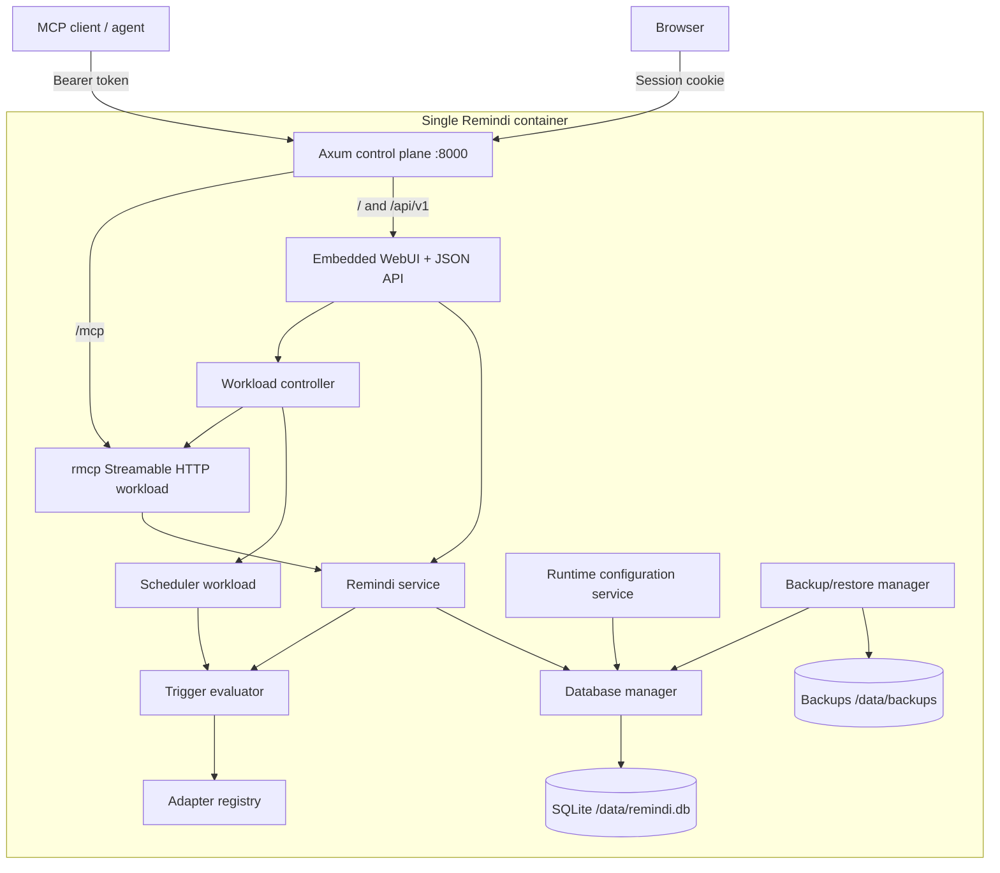

# Remindi MCP Server — Implementation Design

| Field | Value |
|---|---|
| Document status | Draft for implementation |
| Version | 1.1.0 |
| Author | Shane Burger |
| Date | 2026-07-18 |
| Last updated | 2026-07-18 |
| Governing specification | `SPEC.md` version 1.2.0 |

## 1. Purpose

This document turns `SPEC.md` into an implementation blueprint for version 1 of
the Remindi MCP server. It fixes the component boundaries, Rust stack, HTTP
routes, database ownership, scheduler design, WebUI behavior, backup/restore
workflow, Docker boundary, and verification plan.

The design is intentionally a modular monolith:

- one Rust binary;
- one Docker container per user;
- one SQLite database;
- one Axum listener at `0.0.0.0:8000`;
- WebUI at `/`;
- Streamable HTTP MCP at `/mcp`;
- one always-running control plane;
- in-process MCP and scheduler workloads;
- no stdio transport, Docker socket, sidecar, frontend runtime, or external
  database.

## 2. Confirmed Decisions

| Area | Decision |
|---|---|
| Language | Rust |
| MCP SDK | Official `rmcp` |
| HTTP stack | Axum, Tokio, and Tower middleware |
| Persistence | SQLx with SQLite |
| Schemas | Serde and Schemars |
| Observability | `tracing` with structured JSON output |
| MCP transport | Streamable HTTP only |
| Deployment | One Docker container per user |
| Tenancy | One owner configured by `REMINDI_OWNER_ID` |
| MCP authentication | Required dedicated bearer token |
| Logical sessions | Supplied by the agent; independent from MCP transport sessions |
| Scheduler | Required in v1 and running by default |
| Adapters | All four named adapters implemented in v1 |
| Snooze | Only an already-ready occurrence may be snoozed |
| Final recurrence | Must be completed with evidence or cancelled with reason |
| WebUI | Enabled by default and served on the same listener |
| WebUI authentication | Custom in-app modal and HttpOnly session cookie |
| Administration | Remindi items, adapters, runtime settings, workloads, backups, and restore |
| Container control | Explicitly excluded; no Docker socket |
| Branding | Embedded PHrK defaults with mounted-file overrides |

No owner decision remains open.

## 3. System Architecture



### 3.1 Ownership boundaries

| Mutable domain | Sole writer |
|---|---|
| Remindi rows and audit events | `RemindiService` through `RemindiRepository` |
| Runtime settings | `RuntimeConfigService` |
| Adapter configuration | `AdapterConfigService` |
| Desired workload state | `WorkloadController` |
| Backup records and restore journal | `BackupManager` |
| SQLite migrations | Startup `MigrationRunner` |
| Browser sessions | In-memory `WebSessionStore` |

All SQLite writers use the same SQLx pool and transaction helpers. No component
writes another component’s tables directly.

### 3.2 Failure boundaries

- A failed MCP request does not stop the control plane.
- A failed scheduler iteration records an error and retries at the next poll.
- One failed adapter does not cancel unrelated adapter evaluations.
- Stopping MCP or scheduler does not stop the WebUI.
- Restore places Remindi APIs in maintenance mode but retains the control plane.
- A failed restore rolls back to the verified pre-restore backup.

## 4. Rust Project Layout

```text
.
├── Cargo.toml
├── Cargo.lock
├── Dockerfile
├── compose.yaml
├── migrations/
│   ├── 0001_initial.sql
│   └── 0002_admin_webui.sql
├── src/
│   ├── main.rs
│   ├── app.rs
│   ├── config.rs
│   ├── error.rs
│   ├── clock.rs
│   ├── auth/
│   │   ├── mod.rs
│   │   ├── mcp.rs
│   │   ├── web_session.rs
│   │   └── csrf.rs
│   ├── db/
│   │   ├── mod.rs
│   │   ├── manager.rs
│   │   ├── migrations.rs
│   │   └── transactions.rs
│   ├── remindi/
│   │   ├── mod.rs
│   │   ├── model.rs
│   │   ├── repository.rs
│   │   ├── service.rs
│   │   ├── state_machine.rs
│   │   ├── recurrence.rs
│   │   └── evidence.rs
│   ├── triggers/
│   │   ├── mod.rs
│   │   ├── evaluator.rs
│   │   └── adapters/
│   │       ├── mod.rs
│   │       ├── observation_window.rs
│   │       ├── http_health.rs
│   │       ├── tcp_reachable.rs
│   │       └── file_exists.rs
│   ├── scheduler/
│   │   ├── mod.rs
│   │   ├── lease.rs
│   │   └── runner.rs
│   ├── mcp/
│   │   ├── mod.rs
│   │   ├── server.rs
│   │   ├── schemas.rs
│   │   ├── responses.rs
│   │   └── tools/
│   ├── admin/
│   │   ├── mod.rs
│   │   ├── settings.rs
│   │   ├── adapters.rs
│   │   ├── workloads.rs
│   │   ├── audit.rs
│   │   └── backup.rs
│   ├── http/
│   │   ├── mod.rs
│   │   ├── router.rs
│   │   ├── middleware.rs
│   │   ├── health.rs
│   │   └── api/
│   └── webui/
│       ├── mod.rs
│       ├── assets.rs
│       └── static/
│           ├── index.html
│           ├── app.css
│           ├── app.js
│           ├── logo.svg
│           └── favicon.svg
└── tests/
    ├── contract/
    ├── database/
    ├── adapters/
    ├── webui/
    ├── restore/
    └── e2e/
```

The crate exposes a library target for integration tests and one production
binary. Frontend assets are embedded at compile time.

## 5. Dependency Policy

Required crate families:

| Concern | Crate |
|---|---|
| MCP | `rmcp` with server and Streamable HTTP server features |
| HTTP | `axum`, `tower`, `tower-http`, `http`, `http-body-util` |
| Async | `tokio`, `tokio-util`, `futures` |
| Persistence | `sqlx` with SQLite and Tokio runtime features |
| Data/schema | `serde`, `serde_json`, `schemars` |
| Time | `time` |
| IDs and hashes | `uuid`, `sha2`, `base64` |
| Secrets and comparisons | `secrecy`, `subtle` |
| Sessions | a small audited in-memory session implementation or `tower-sessions` |
| Errors | `thiserror`, `anyhow` only at process boundaries |
| Logging | `tracing`, `tracing-subscriber` |
| HTTP adapter | `reqwest` with rustls and redirects disabled by policy |
| Static assets | `rust-embed` or compile-time `include_bytes!` |

Implementation pins current compatible releases in `Cargo.lock`. The `rmcp`
version must expose `StreamableHttpService` and the required tool annotations.
A dependency compatibility spike runs before feature implementation; generated
or third-party skill templates are not version authority.

## 6. Process and Application State

```rust
struct AppState {
    bootstrap: Arc<BootstrapConfig>,
    database: Arc<DatabaseManager>,
    remindi: Arc<RemindiService>,
    adapters: Arc<AdapterRegistry>,
    runtime_config: Arc<RuntimeConfigService>,
    workloads: Arc<WorkloadController>,
    backups: Arc<BackupManager>,
    web_sessions: Arc<WebSessionStore>,
    maintenance: Arc<MaintenanceGate>,
    clock: Arc<dyn Clock>,
}
```

`BootstrapConfig` contains secret values using secret wrappers and never derives
`Debug` or `Serialize`. Read-only configuration responses are built from a
separate redacted DTO.

### 6.1 Maintenance gate

The database manager provides:

- a shared permit for ordinary database operations;
- an exclusive permit for restore and migration;
- an atomic maintenance reason for immediate `503` responses;
- controlled pool close and reopen.

Handlers do not retain a pool reference outside the permit lifetime. This makes
restore quiescence explicit and testable.

## 7. HTTP Routing

The application binds exactly one internal listener:

```text
0.0.0.0:8000
```

Route tree:

```text
/
├── /                         WebUI entry point
├── /assets/*                 embedded/default or validated override assets
├── /mcp                      rmcp Streamable HTTP
├── /api/v1
│   ├── /auth/login
│   ├── /auth/logout
│   ├── /session
│   ├── /remindi
│   ├── /remindi/check
│   ├── /remindi/{id}
│   ├── /remindi/{id}/complete
│   ├── /remindi/{id}/snooze
│   ├── /remindi/{id}/cancel
│   ├── /remindi/{id}/history
│   ├── /adapters
│   ├── /adapters/{name}
│   ├── /settings
│   ├── /settings/{key}
│   ├── /workloads
│   ├── /workloads/{component}/{action}
│   ├── /admin-events
│   ├── /backups
│   ├── /backups/upload
│   ├── /backups/{id}/download
│   └── /backups/{id}/restore
└── /health
    ├── /live
    └── /ready
```

Unknown routes return JSON for `/api/*` and a normal `404` elsewhere. The WebUI
is not a catch-all router for arbitrary paths.

### 7.1 Middleware order

Outer to inner:

1. request ID generation or validation;
2. safe proxy/header normalization;
3. Host validation;
4. body-size limit;
5. structured tracing with redaction;
6. security response headers;
7. route-specific timeout;
8. route-specific authentication;
9. Origin and CSRF validation for browser mutations;
10. handler.

CORS is not globally permissive. WebUI routes are same-origin. `/mcp` accepts
only configured origins and bearer authentication.

## 8. Authentication

### 8.1 MCP authentication

- Read `REMINDI_MCP_TOKEN` at startup.
- Reject empty, whitespace-only, or trivially short tokens.
- Parse only `Authorization: Bearer`.
- Compare token bytes in constant time.
- Never accept token query parameters or cookies.
- Derive the actor as a stable non-secret fingerprint scoped to the configured
  owner.
- Return `401` without echoing authentication details.

The MCP token does not authenticate WebUI routes.

### 8.2 WebUI login

The unauthenticated shell renders the PHrK-styled sign-in modal. Login posts
username, password, and the pre-session CSRF nonce to `/api/v1/auth/login`.

On success:

1. compare both environment credentials in constant time;
2. create a random 256-bit session identifier;
3. store the session, CSRF secret, issued time, expiry, and reauthentication time
   in memory;
4. return an HttpOnly, SameSite=Strict cookie;
5. clear password fields in the browser;
6. load the authenticated application.

Credentials are not written to localStorage, sessionStorage, IndexedDB, cookies,
logs, SQLite, or audit details.

`REMINDI_WEBUI_COOKIE_SECURE=true` adds `Secure`. Deployment documentation
requires it whenever the browser-facing URL uses HTTPS.

### 8.3 Authentication-disabled mode

When `REMINDI_WEBUI_AUTH=false`, WebUI API requests receive a synthetic
`webui:unauthenticated` actor. The UI shows a persistent warning banner. Restore
is disabled when no WebUI credentials are configured. If both credential
variables are present, restore still requires password reauthentication and the
exact confirmation phrase.

## 9. Remindi Domain Model

Rust uses enums for state, trigger, readiness, recurrence policy, priority,
evidence type, and event type. External strings are serialized in the exact
snake-case form specified by `SPEC.md`.

### 9.1 Owner handling

`owner_id` remains a database column for integrity, export clarity, and possible
future migration. It is populated only from `REMINDI_OWNER_ID`.

No MCP or WebUI request type includes `owner_id`. Every repository query binds
the configured owner even when selecting by globally unique `remindi_id`.

### 9.2 Time fields

- Domain logic uses UTC instants.
- Persistence uses canonical RFC 3339 UTC strings with millisecond precision.
- `next_fire_at` schedules time and interval occurrences.
- `next_evaluation_at` schedules condition-adapter polling.
- `snooze_until` suppresses an already-ready occurrence.
- `due_since` is preserved through snooze.
- All comparisons use the injected `Clock`.

### 9.3 Snooze

Snooze is accepted only from `due` or `overdue`. The transaction:

1. checks expected version;
2. records `snoozed_from_state`;
3. sets `snooze_until`;
4. changes state to `snoozed`;
5. increments `snooze_count` and version;
6. appends the event and idempotency response.

At expiry, the evaluator clears the snooze fields, returns the occurrence to
`due`, recalculates overdue readiness from the preserved `due_since`, and emits
only the required transition event.

### 9.4 Final recurrence

Before accepting `occurrence_disposition`, recurrence logic calculates whether a
next occurrence exists under both `max_occurrences` and `end_at`. If none exists,
the update returns `INVALID_STATE` with an instruction to complete with evidence
or cancel with a reason.

## 10. Database Design

### 10.1 Connection setup

Every SQLx connection applies:

```sql
PRAGMA foreign_keys = ON;
PRAGMA busy_timeout = 5000;
PRAGMA synchronous = FULL;
```

Startup enables and verifies WAL mode once. The pool starts with a conservative
maximum of eight connections and one logical writer. Every transaction that may
write begins `IMMEDIATE`.

### 10.2 Query discipline

- Repository methods use bound parameters only.
- Dynamic filtering builds from allowlisted columns and operators.
- List and history pagination use keyset cursors, not `OFFSET`.
- Cursors are versioned, opaque, base64url-encoded JSON with a keyed integrity
  tag derived from the secret MCP token through a domain-separated KDF. The
  token fingerprint itself is never used as a key.
- External adapter calls occur outside transactions.
- A post-adapter write rechecks the item version and trigger state.

### 10.3 Migration policy

- SQL migrations are embedded and checksummed.
- Startup refuses a database newer than the binary.
- A migration lock prevents concurrent migration.
- A verified backup precedes any breaking migration.
- CI applies every migration to empty and prior supported databases.

## 11. MCP Server

The `rmcp` server registers exactly eight tools:

| Tool | Purpose |
|---|---|
| `remindi_add` | Create one Remindi item and its initial audit event. |
| `remindi_check` | Evaluate applicable items and return due or overdue work. |
| `remindi_complete` | Complete one item with structured evidence. |
| `remindi_snooze` | Move one ready item to a later check time with a reason. |
| `remindi_update` | Change mutable fields using optimistic concurrency. |
| `remindi_list` | List items without evaluating triggers or changing state. |
| `remindi_cancel` | Cancel one active item with a reason. |
| `remindi_history` | Return ordered events and completion evidence for one item. |

Register these identifiers exactly as written. Schema, storage, or prose naming
changes must not rewrite an actual MCP tool-call name.

An LLM treats “Remindi” as a verb and maps natural language to these tools. For
example:

| LLM instruction | Expected tool behavior |
|---|---|
| “Remindi me tomorrow at 09:00 to verify the deployment.” | Call `remindi_add` with an `at_time` trigger. |
| “Remindi this at the next work session.” | Call `remindi_add` with a `next_session` trigger and the logical work-session fields. |
| “Check Remindi before you finish.” | Call `remindi_check` with `lifecycle_event=final_review`. |
| “Snooze this Remindi item until 14:00 because maintenance moved.” | Call `remindi_snooze` with a future time and the stated reason. |
| “Complete it using the passing test report.” | Call `remindi_complete` with structured evidence. |

Each tool has:

- a concise description;
- complete parameter descriptions;
- `inputSchema`;
- `outputSchema`;
- `structuredContent`;
- a text JSON fallback;
- `title`, `readOnlyHint`, `destructiveHint`, `idempotentHint`, and
  `openWorldHint` annotations as applicable.

`remindi_list` and `remindi_history` are read-only. `remindi_check` is
mutating. Completion and cancellation are terminal but not data-deleting.

The MCP workload uses rmcp’s in-memory Streamable HTTP session manager.
Restarting the workload invalidates MCP transport sessions and requires client
reinitialization. The item’s `session_id` remains a separate logical identifier
supplied in tool input.

When desired MCP state is `stopped`, `/mcp` returns a bounded `503` response with
`Retry-After`; it does not route into rmcp.

## 12. Scheduler

The scheduler runs as one Tokio task managed by a `CancellationToken`.

Loop:

1. load current runtime settings;
2. acquire or renew the `trigger-evaluator` lease;
3. query bounded candidate batches ordered by evaluation time and ID;
4. evaluate pure time/session-independent triggers locally;
5. evaluate due condition candidates concurrently up to the configured limit;
6. apply results in short compare-and-swap transactions;
7. update health metrics;
8. wait until the next poll or cancellation/configuration signal.

The scheduler never marks Remindi items complete and never performs external
delivery. Pull checks remain authoritative for surfacing context-sensitive
session, continuation, and goal triggers because the scheduler does not invent
agent context.

### 12.1 Scheduler candidates

Background evaluation handles:

- `at_time`;
- `after_elapsed`;
- `interval`;
- snooze expiry;
- overdue transitions;
- condition triggers whose `next_evaluation_at` has arrived;
- manual-verification deadlines.

`next_session`, `next_continuation`, and `goal_active` require explicit
`remindi_check` context and remain scheduled until such a check.

## 13. Condition Adapters

All adapters implement:

```rust
#[async_trait]
trait ConditionAdapter: Send + Sync {
    fn name(&self) -> &'static str;
    fn version(&self) -> &'static str;
    fn parameter_schema(&self) -> RootSchema;
    async fn evaluate(
        &self,
        params: Value,
        deadline: Instant,
        cancel: CancellationToken,
    ) -> AdapterResult;
}
```

### 13.1 `observation_window_ended`

Pure comparison of configured `window_end` against the server clock. It requires
no target alias and performs no I/O.

### 13.2 `http_health`

Configuration maps an alias to:

- an HTTPS URL;
- allowed expected status codes;
- response-size cap;
- optional expected content type;
- redirect policy, false by default.

Every request:

- resolves DNS at evaluation time;
- validates every address against the configured network policy;
- uses rustls certificate verification;
- sends no ambient credentials or cookies;
- does not return the response body;
- applies connect and total deadlines.

### 13.3 `tcp_reachable`

Configuration maps an alias to a hostname and port. Evaluation resolves and
validates every address, attempts only a TCP connection, sends no bytes, applies
a deadline, and closes immediately.

### 13.4 `file_exists`

Configuration maps a path alias to an absolute path below an allowlisted root.
Startup and updates canonicalize the root. Evaluation uses metadata only,
rejects traversal and unsafe symlink escape, and never reads file content.

### 13.5 Configuration activation

The WebUI submits typed adapter configuration. The server validates a candidate
fully, writes it with expected-version protection, rebuilds an immutable adapter
snapshot, then atomically swaps the active snapshot. Invalid configuration never
partially activates.

## 14. WebUI Design

### 14.1 Frontend shape

The WebUI is plain semantic HTML, CSS, and modular ES JavaScript embedded in the
binary. It has no React/Vue framework, Node runtime, external font, external CDN,
analytics, or service worker.

Primary views:

1. Dashboard
2. Remindi items
3. Remindi item detail and history
4. Adapters
5. Runtime settings
6. Workloads
7. Backups and restore
8. Administrative audit

The URL query string carries filters, pagination cursor, selected tab, and
expanded item so views are reloadable and linkable.

### 14.2 Visual system

Defaults are derived from `cdn-phrk-org` commit
`8314e6b8b0b36b360fe9b60c01cde7653bd93dbe`:

```css
:root {
  color-scheme: dark;
  --bg: #080a0f;
  --panel: #11151f;
  --panel-2: #171c28;
  --line: #252d3c;
  --text: #edf2ff;
  --muted: #9aa6ba;
  --subtle: #67748a;
  --accent: #56b6ff;
  --accent-2: #7ce7c6;
  --danger: #ff7676;
}
```

The design uses cyan/magenta ambient gradients, translucent dark panels, compact
radii, blur, deep shadow, the white PHrK logo, and Inter/system-ui typography.
Each item’s priority and state use accessible text labels and icons; color alone
never carries meaning.

### 14.3 Accessibility and interaction

- Include a skip link and semantic landmarks.
- Label every input and expose inline actionable errors.
- Trap focus within modals and restore it to the invoking control.
- Support Escape where cancellation is safe.
- Give icon-only controls accessible names.
- Provide visible `:focus-visible` treatment.
- Use real buttons for actions and links for navigation.
- Announce async status through `aria-live="polite"`.
- Preserve browser zoom.
- Honor `prefers-reduced-motion`.
- Render tables as labelled blocks below 760 px.
- Use `Intl.DateTimeFormat` and `Intl.NumberFormat`.
- Confirm disruptive actions; restore additionally uses reauthentication and the
  exact typed phrase.

### 14.4 Custom assets

At startup:

- blank override variables select embedded defaults;
- custom CSS is capped at 256 KiB and served after default CSS;
- logo is capped at 2 MiB and restricted to approved image types;
- favicon is capped at 512 KiB and restricted to approved icon/image types;
- paths must be absolute, regular, non-world-writable, and readable;
- files are read once and held as immutable bytes;
- failures stop startup rather than silently serving unexpected content.

CSP blocks remote scripts, styles, fonts, frames, and network destinations.
Custom CSS may alter presentation but cannot relax server security headers.

## 15. WebUI JSON API

The API uses a common envelope:

```json
{
  "ok": true,
  "request_id": "req_...",
  "data": {}
}
```

Errors use the specification’s structured error envelope.

### 15.1 Remindi endpoints

| Method and route | Service operation |
|---|---|
| `GET /api/v1/remindi` | list |
| `POST /api/v1/remindi` | add |
| `POST /api/v1/remindi/check` | check |
| `GET /api/v1/remindi/{id}` | detail plus current version |
| `PATCH /api/v1/remindi/{id}` | update |
| `POST /api/v1/remindi/{id}/complete` | complete |
| `POST /api/v1/remindi/{id}/snooze` | snooze |
| `POST /api/v1/remindi/{id}/cancel` | cancel |
| `GET /api/v1/remindi/{id}/history` | history |

WebUI request DTOs reuse domain validators but not MCP transport types.

### 15.2 Administration endpoints

Runtime setting and adapter updates require `expected_version`. Workload actions
accept `start`, `stop`, or `restart` and an idempotency key. Backup creation and
restore also require idempotency keys.

Responses never include:

- MCP token;
- WebUI username or password;
- raw environment values marked secret;
- session identifiers;
- complete uploaded filesystem paths;
- adapter response bodies.

## 16. Runtime Configuration

### 16.1 Bootstrap configuration

Environment-only, read-only in WebUI:

- database and backup paths;
- owner ID;
- MCP token;
- listener address, which is fixed internally;
- allowed hosts and origins;
- WebUI enable/auth flags and credentials;
- session and cookie bootstrap options;
- custom asset paths;
- log content policy.

Exact environment contract:

| Variable | Default |
|---|---|
| `REMINDI_DB_PATH` | `/data/remindi.db` |
| `REMINDI_OWNER_ID` | required |
| `REMINDI_MCP_TOKEN` | required |
| `REMINDI_BACKUP_DIR` | `/data/backups` |
| `REMINDI_HTTP_ALLOWED_HOSTS` | empty |
| `REMINDI_HTTP_ALLOWED_ORIGINS` | same origin |
| `REMINDI_LOG_LEVEL` | `info` |
| `REMINDI_LOG_CONTENT` | `false` |
| `REMINDI_WEBUI_ENABLE` | `true` |
| `REMINDI_WEBUI_AUTH` | `true` |
| `REMINDI_WEBUI_USERNAME` | required when WebUI auth is enabled |
| `REMINDI_WEBUI_PASSWORD` | required when WebUI auth is enabled |
| `REMINDI_WEBUI_SESSION_TTL_SECONDS` | `43200` |
| `REMINDI_WEBUI_COOKIE_SECURE` | `false` |
| `REMINDI_WEBUI_TITLE` | `Remindi` |
| `REMINDI_WEBUI_CUSTOM_CSS_FILE` | empty |
| `REMINDI_WEBUI_LOGO_FILE` | empty |
| `REMINDI_WEBUI_FAVICON_FILE` | empty |

`REMINDI_WEBUI_HOST` and `REMINDI_WEBUI_PORT` are deliberately absent from
`BootstrapConfig`: Compose consumes them when publishing host port 8000, and the
application always binds `0.0.0.0:8000`.

### 16.2 Mutable configuration

SQLite-backed:

- scheduler polling and lease duration;
- adapter timeout and concurrency;
- recurrence catch-up cap;
- default overdue duration;
- maximum snooze horizon;
- idempotency retention;
- backup interval, retention count, and upload cap;
- all adapter enabled states and aliases;
- desired MCP and scheduler state.

Changes that affect a running scheduler signal it to reload. Adapter changes
atomically replace the registry snapshot. UI labels each setting as immediate or
requiring workload restart.

## 17. Workload Control

`WorkloadController` serializes lifecycle actions under one administrative
mutex.

State:

```text
desired: running | stopped       persisted
actual: starting | running | stopping | stopped | failed   in memory
```

The API accepts `mcp`, `scheduler`, or virtual component `all`. `all` updates
both individual desired-state rows in one transaction and then performs the
ordered transitions; it is not stored as a third component.

### 17.1 MCP

- Start constructs or enables the rmcp Streamable HTTP service.
- Stop rejects new `/mcp` requests, drains bounded in-flight calls, cancels
  outstanding work, and invalidates transport sessions.
- Restart performs stop then start.

### 17.2 Scheduler

- Start acquires the scheduler lease and spawns the runner.
- Stop cancels the runner, waits for active adapter deadlines, and releases the
  lease.
- Restart performs stop then start with current configuration.

The desired state is persisted before transition. If transition fails, actual
state becomes `failed`, desired state remains explicit, and an administrative
event records the bounded error. Startup retries desired `running` components.

## 18. Backup and Restore

### 18.1 Backup file format

A backup is a complete SQLite database file created through the online backup API
or `VACUUM INTO`. Its record contains:

- UUID;
- safe generated filename;
- source;
- SHA-256;
- byte size;
- schema version;
- creation and verification times;
- actor;
- bounded status details.

Each backup has a matching non-secret, fsync-backed JSON sidecar manifest with
the same metadata. Filenames never derive directly from user input. Startup and
post-restore reconciliation rebuild missing `backup_records` rows only from
files whose database digest and manifest both verify.

### 18.2 Manual and automatic backup

Creation:

1. reserve a record and temporary filename;
2. run the online backup operation;
3. fsync the file and containing directory;
4. open read-only and run integrity and schema checks;
5. hash the final bytes;
6. atomically rename;
7. mark ready and append audit.

Automatic backups use the same path. Retention removes the oldest eligible
automatic/upload files beyond the configured count and retains their audit
records as expired. Manual and pre-restore backups are not automatically removed
unless an explicit future policy says so.

### 18.3 Upload

- Stream multipart bytes directly to a bounded temporary file.
- Do not buffer the database in memory.
- Reject excess size while streaming.
- Require a valid SQLite header, supported page size, integrity, supported schema,
  configured-owner match, and application invariants.
- Never attach an uploaded database to the live connection.
- Rename and mark ready only after full verification.

### 18.4 Restore state machine

```text
requested
  -> candidate_verified
  -> pre_restore_backup_verified
  -> workloads_quiesced
  -> live_replaced
  -> replacement_verified
  -> workloads_restarted
  -> succeeded

Any failure after workloads_quiesced
  -> rollback_started
  -> pre_restore_reinstalled
  -> rollback_verified
  -> workloads_restarted_or_held
  -> failed
```

The restore journal is a small fsync-backed JSON file containing only operation
IDs, phases, and safe local filenames. Startup inspects it before opening the
database and deterministically completes verification or rollback.

After installing a replacement, restore clears transient scheduler leases before
workloads restart and reconciles backup inventory from verified sidecar
manifests. It then records the restore outcome in the active database.

## 19. Error Mapping

Layers map errors once:

- SQLite and SQLx errors -> repository errors;
- domain violations -> service errors;
- MCP handlers -> MCP tool errors with structured content;
- WebUI handlers -> HTTP status plus the common JSON envelope.

Authentication and protocol framing failures use HTTP status codes. Remindi item
business errors remain tool/API results. Internal errors expose a request ID and
safe code, not paths, SQL, secrets, or backtraces.

## 20. Observability

Every request span includes:

- request ID;
- route class or MCP tool;
- actor pseudonym;
- authorized `remindi_id` where relevant;
- duration;
- outcome and error code.

Metrics represented through structured health state:

- database health and size;
- WAL size;
- active item counts;
- oldest ready age;
- scheduler desired/actual state and last iteration;
- adapter evaluation counts, latency, and bounded failures;
- MCP desired/actual state and active transport sessions;
- last backup and restore result.

No Remindi item content, evidence detail, credential, token, raw adapter response, or
raw request body is logged by default.

## 21. Docker Design

### 21.1 Build

Multi-stage build:

1. pinned Rust builder compiles with `--locked --release`;
2. tests and vulnerability/license checks run in CI, not in the runtime image;
3. final image contains the binary, required CA certificates, and an empty
   `/data` mount point;
4. final process runs as a fixed non-root UID/GID.

The runtime filesystem is read-only except `/data` and bounded `/tmp`.

### 21.2 Port mapping

Compose:

```yaml
ports:
  - "${REMINDI_WEBUI_HOST:-127.0.0.1}:${REMINDI_WEBUI_PORT:-8000}:8000"
```

These two variables are Compose interpolation inputs only. The application always
listens on `0.0.0.0:8000` inside the container.

### 21.3 Container health

The Docker health check calls `/health/live`. It proves only that the control
plane responds. Detailed readiness remains authenticated and distinguishes
intentionally stopped workloads from failures.

## 22. Security Design

Required controls:

- one owner per container and no owner selector;
- dedicated MCP token separate from WebUI credentials;
- WebUI auth on by default;
- loopback host publishing by default;
- TLS for remote browser or MCP access;
- Host, Origin, CSRF, session, and body-size enforcement;
- constant-time secret comparisons;
- protected SQLite, backup, and override files;
- no Docker socket;
- no arbitrary commands, SQL, URLs, hosts, ports, or paths in Remindi item data;
- all external adapter targets resolved from authenticated admin aliases;
- no third-party browser dependencies;
- restrictive CSP and response headers;
- restore reauthentication, confirmation, maintenance lock, and rollback.

Security-sensitive configuration changes are never accepted through generic
key/value endpoints.

## 23. Testing Design

### 23.1 Test layers

| Layer | Focus |
|---|---|
| Unit | clocks, trigger boundaries, state machine, recurrence, evidence, validators |
| Property | recurrence advancement, cursor ordering, idempotency invariants |
| Database | migrations, constraints, transactions, indexes, busy behavior |
| MCP contract | discovery, schemas, annotations, auth, structured output |
| HTTP router | middleware, sessions, CSRF, security headers, status mapping |
| Adapter | functionality, SSRF/path containment, deadlines, cancellation |
| Scheduler | lease, candidate selection, restart, desired state |
| WebUI | DOM behavior, accessibility, responsive rendering, long content |
| Backup/restore | backup, upload, validation, swap, rollback, crash phases |
| Docker E2E | non-root image, port, persistence, restart, health |

### 23.2 Determinism

Clock, UUID generation, filesystem roots, network resolution, HTTP client, and
adapter results have injectable test implementations. Tests never depend on wall
clock sleeps for Remindi timing semantics.

### 23.3 Browser verification

Run the built container and verify in a real browser:

- sign-in modal and error recovery;
- dashboard and all eight Remindi operations;
- version-conflict handling;
- adapter/settings forms;
- workload stop/start while UI stays available;
- backup upload and guarded restore;
- keyboard-only operation;
- desktop and mobile breakpoints;
- default and custom branding;
- security headers and absence of browser-native Basic Auth.

Screenshots are verification evidence only after rendering the actual built
application.

## 24. Implementation Sequence

### Phase 1 — Foundation

- Scaffold crate, configuration, error model, clock, tracing, and Axum listener.
- Add migrations and `DatabaseManager`.
- Verify fresh database, pragmas, constraints, and clean shutdown.

### Phase 2 — Remindi core

- Implement models, repository, state machine, recurrence, evidence, and
  idempotency.
- Verify deterministic unit and database suites.

### Phase 3 — MCP

- Implement rmcp Streamable HTTP service and eight tools.
- Add bearer middleware, schemas, output schemas, annotations, and contract tests.

### Phase 4 — Scheduler and adapters

- Implement lease, candidate selection, all four adapters, and cancellation.
- Verify timing, containment, concurrency, and restart behavior.

### Phase 5 — WebUI Remindi surface

- Embed PHrK-themed static assets.
- Implement modal authentication, sessions, CSRF, the Remindi API, and the
  Remindi UI.
- Run router, browser, accessibility, and responsive tests.

### Phase 6 — Administration

- Implement runtime settings, adapter administration, admin audit, and workload
  controller.
- Verify redaction, allowlists, version conflicts, persistence, and UI controls.

### Phase 7 — Backup and restore

- Implement online backups, upload validation, retention, restore journal,
  quiescence, atomic swap, and rollback.
- Run failure injection and process-loss recovery tests.

### Phase 8 — Docker acceptance

- Build the final image and Compose example.
- Run persistence, restart, security, health, browser, performance, backup, and
  restore acceptance scenarios.
- Reconcile implementation and documentation before release.

No phase may treat its output as accepted until its targeted checks pass.

## 25. Requirement Traceability

| Specification area | Design sections |
|---|---|
| Scope and deployment | 1–3, 21 |
| Remindi lifecycle and triggers | 9, 12 |
| SQLite and concurrency | 6, 10 |
| Eight MCP tools | 7, 8, 11 |
| Four adapters | 12–13 |
| Scheduler | 12, 17 |
| WebUI and authentication | 7–8, 14–15 |
| Runtime and adapter configuration | 13, 16 |
| Workload control | 17 |
| Backup and restore | 18 |
| Security and privacy | 8, 19–22 |
| Testing and acceptance | 23–24 |

Detailed implementation tests must retain requirement IDs from `SPEC.md` in test
names or metadata so evidence can be traced in both directions.

## 26. References

- `SPEC.md`
- `https://github.com/modelcontextprotocol/rust-sdk`
- `https://modelcontextprotocol.io/specification/draft/basic/transports`
- `https://www.sqlite.org/docs.html`
- `https://git.phrk.org/pub/cdn-phrk-org`
- PHrK visual baseline commit:
  `8314e6b8b0b36b360fe9b60c01cde7653bd93dbe`
