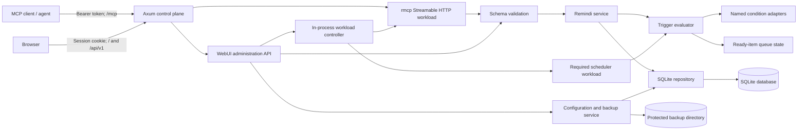
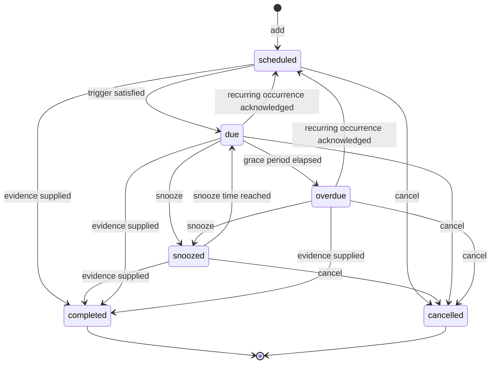

# Remindi MCP Server — Technical Specification

| Field | Value |
|---|---|
| Document status | Draft for timestamp wire-format correction |
| Version | 1.3.0 |
| Author | Shane Burger |
| Date | 2026-07-18 |
| Last updated | 2026-07-19 |

## 1. Executive Summary

Remindi provides durable, evidence-backed work items for agents and users
performing work across sessions. A stored unit of future work is a **Remindi
item**. Remindi addresses tasks such as “collect evidence after 24 hours,”
“recheck the service tomorrow,” and “clean up temporary state after acceptance.”

The Remindi MCP server is a single-user Rust application deployed as one Docker
container. It persists Remindi items in SQLite and exposes eight Model Context
Protocol (MCP) tools over Streamable HTTP to create, inspect, check, update,
snooze, complete, cancel, and audit them. It supports time, elapsed-time,
recurrence, next-session, related-goal, and safe named-condition triggers.

An MCP server cannot wake a disconnected client by itself. Version 1 therefore
uses both of these mechanisms:

1. **Pull mode:** `AGENTS.md` requires `remindi_check` at task start,
   checkpoints, continuations, and final review.
2. **Scheduler mode:** a required background loop evaluates triggers and makes
   Remindi items ready even when no MCP client is connected.

The same HTTP listener serves a simple administration WebUI. The WebUI manages
Remindi items, condition adapters, safe runtime configuration, backups and restores,
and the in-process MCP and scheduler workloads. External notification delivery
remains outside version 1. Pull checks remain mandatory and do not get replaced
by scheduler evaluation or the WebUI.

### 1.1 LLM-facing usage

An LLM may treat **Remindi** as a verb meaning “record or revisit this through
the Remindi MCP server.” General agent instructions can say:

- “Make sure to Remindi work that you need to do later.”
- “Remindi tasks that you must check on.”

More specific prompts produce clearer tool calls:

- “Remindi me at 09:00 tomorrow to verify the deployment. Require the
  health-check output before completion.”
- “Remindi this task at the next work session so I can review the 24-hour
  observation evidence.”
- “Remindi me to check the service every 15 minutes until it is healthy. Do not
  complete the item without evidence.”
- “Check Remindi for anything due on this project before you finish.”
- “Snooze this Remindi item until 14:00 because the maintenance window moved.”
- “Complete the Remindi item using the passing test report as evidence.”

The LLM translates these instructions into the tools listed in Section 14.
Natural-language use does not weaken evidence, cancellation-reason, version, or
idempotency requirements.

## Table of Contents

- [1. Executive Summary](#1-executive-summary)
- [2. Problem Statement](#2-problem-statement)
- [3. Scope](#3-scope)
- [4. Goals and Non-Goals](#4-goals-and-non-goals)
- [5. Terminology](#5-terminology)
- [6. Functional Requirements](#6-functional-requirements)
- [7. Non-Functional Requirements](#7-non-functional-requirements)
- [8. Architecture](#8-architecture)
- [9. Data Model and SQLite Schema](#9-data-model-and-sqlite-schema)
- [10. Remindi State Machine](#10-remindi-state-machine)
- [11. Trigger Semantics](#11-trigger-semantics)
- [12. Recurrence](#12-recurrence)
- [13. Condition Adapters](#13-condition-adapters)
- [14. MCP Tool Contract](#14-mcp-tool-contract)
- [15. Evidence Requirements](#15-evidence-requirements)
- [16. AGENTS.md Integration](#16-agentsmd-integration)
- [17. Security and Privacy](#17-security-and-privacy)
- [18. Concurrency and Idempotency](#18-concurrency-and-idempotency)
- [19. Errors](#19-errors)
- [20. Logging and Audit](#20-logging-and-audit)
- [21. Configuration](#21-configuration)
- [22. Startup, Shutdown, Backup, and Migration](#22-startup-shutdown-backup-and-migration)
- [23. Testing Strategy](#23-testing-strategy)
- [24. Deployment](#24-deployment)
- [25. Roadmap](#25-roadmap)
- [26. Risks and Mitigations](#26-risks-and-mitigations)
- [27. Acceptance Criteria](#27-acceptance-criteria)
- [28. Definition of Done](#28-definition-of-done)
- [Appendix A — Example Workflow](#appendix-a--example-workflow)
- [Appendix B — Design Decisions](#appendix-b--design-decisions)

## 2. Problem Statement

Agents can record future work in plans, memories, or documentation, but those
records are passive. They do not reliably reappear when their observation window,
acceptance date, or cleanup time arrives. This creates a failure mode where the
next check was documented correctly and then forgotten.

The system must:

- preserve Remindi items across process and client restarts;
- identify due, overdue, session-triggered, goal-triggered, and
  condition-satisfied work;
- retain every meaningful change in an audit history;
- require evidence before a Remindi item is marked complete;
- support safe rescheduling without erasing prior deadlines;
- avoid arbitrary stored code or shell execution;
- remain useful even when no background scheduler is running.

## 3. Scope

### 3.1 In scope for version 1

- A single-user Rust service using the official `rmcp` SDK, Axum, Tokio, SQLx,
  Serde, Schemars, and `tracing`.
- Streamable HTTP transport at `/mcp`; no stdio transport.
- A required bearer token dedicated to the MCP endpoint.
- One configured owner identity per container.
- Docker as the supported deployment method.
- Persistent SQLite storage.
- One-shot time and elapsed-time triggers.
- Fixed-interval recurrence until completion or cancellation.
- Next-session and next-continuation triggers.
- Related-goal activation triggers.
- All four named, allowlisted, read-only condition adapters:
  `observation_window_ended`, `http_health`, `tcp_reachable`, and `file_exists`.
- Manual-verification fallback for conditions without a configured adapter.
- Project, task, user, goal, and memory-hash associations.
- Evidence-backed completion.
- Snooze, update, cancellation, listing, and immutable audit history.
- Pull-based due checks on agent lifecycle events.
- Required background trigger evaluation, enabled by default and controllable
  through the WebUI.
- Concurrency control, idempotent mutations, structured errors, and logs.
- Canonical UTC RFC 3339 timestamp strings in all server-owned timestamp fields
  returned by MCP tools.
- Backup, migration, health, and operational guidance.
- A dependency-light WebUI and JSON administration API on the same listener.
- An application-rendered sign-in modal with optional WebUI authentication.
- WebUI management of all eight Remindi operations, adapters, safe mutable runtime
  settings, backups, verified restores, and in-process workload lifecycle.
- Embedded PHrK defaults based on `cdn-phrk-org`, with read-only custom CSS,
  logo, favicon, and title overrides selected by environment variables.

### 3.2 Out of scope for version 1

- Arbitrary shell commands, scripts, SQL, URLs, or executable code stored as
  Remindi item conditions.
- A general-purpose job runner or workflow engine.
- Guaranteed wake-up of disconnected MCP clients.
- Email, SMS, push, Slack, Teams, or calendar delivery as built-in features.
- Browser push notifications or a guarantee that the WebUI is open.
- Distributed scheduling across multiple active writers.
- Complex calendar recurrence such as RRULE, business days, or holiday calendars.
- Chained workflows, dependencies, approvals, or escalation policies.
- Automatic proof generation or treating an adapter result as completion evidence.
- Semantic interpretation of free-form conditions.
- Secrets management.
- Multi-region replication or high-availability clustering.
- Docker socket access or control of the container lifecycle from the WebUI.
- Editing bootstrap, security, credential, bind, or filesystem settings from the
  WebUI.
- Manual deletion of backup files through the WebUI.
- Localized, relative, or natural-language timestamp rendering in MCP results.
- Unix epoch numbers, component arrays, or multiple timestamp representations
  selected through content negotiation.
- Rewriting timestamp-like values inside caller-supplied opaque metadata.

## 4. Goals and Non-Goals

### 4.1 Goals

| ID | Goal |
|---|---|
| G-01 | A due Remindi item survives restarts and is returned on the next applicable check. |
| G-02 | Every state change is attributable and auditable. |
| G-03 | Completion cannot occur without structured evidence. |
| G-04 | Snoozing preserves the original schedule and records a reason. |
| G-05 | Duplicate retried mutations do not create duplicate Remindi items or events. |
| G-06 | Trigger evaluation is deterministic for a supplied clock and context. |
| G-07 | Condition evaluation cannot execute arbitrary stored instructions. |
| G-08 | The server operates safely as a small, single-node service. |
| G-09 | One user can operate and recover their container through a protected WebUI. |
| G-10 | The scheduler evaluates Remindi items independently of connected MCP clients. |
| G-11 | Bootstrap secrets remain environment-owned and are never exposed by the WebUI. |
| G-12 | An agent can read every server-owned MCP timestamp directly as one canonical JSON string. |

### 4.2 Non-goals

- Replacing Memory, goals, issue trackers, or calendars.
- Inferring that work is complete merely because a time or condition trigger fired.
- Providing a human notification application in version 1.
- Solving distributed consensus or exactly-once external delivery.
- Managing other containers or host services.

## 5. Terminology

| Term | Meaning |
|---|---|
| Remindi | The product, MCP server, and verb used in LLM-facing instructions. |
| Remindi item | Durable instruction to revisit or perform work. |
| Trigger | Rule that determines when a Remindi item becomes due. |
| Occurrence | One scheduled instance of a recurring Remindi item. |
| Due | The trigger is satisfied and the Remindi item has not passed its overdue threshold. |
| Overdue | The trigger is satisfied and its deadline plus grace period has passed. |
| Ready | Collective term for due, overdue, or condition-satisfied Remindi items. |
| Evidence | Structured proof supplied when completing a Remindi item. |
| Actor | Authenticated user, agent, scheduler, or system component causing an event. |
| Context | Current user, project, task, session, continuation, and active goals. |
| Condition adapter | Named read-only implementation that evaluates an allowlisted condition. |
| Checkpoint | Agent-defined lifecycle point at which Remindi items are checked. |
| Control plane | The always-running HTTP, WebUI, authentication, configuration, backup, and workload-control layer. |
| Workload | The MCP endpoint or scheduler component controlled in-process by the control plane. |
| Logical work session | Agent-supplied session identity used by Remindi item trigger semantics; it is not an MCP transport session. |
| Bootstrap setting | Environment-owned security, identity, bind, or filesystem configuration that the WebUI may display only in redacted/read-only form. |
| Runtime setting | Safe mutable configuration persisted in SQLite and changeable through the authenticated WebUI. |
| Canonical MCP timestamp | A UTC RFC 3339 JSON string with exactly three fractional-second digits and a `Z` suffix, for example `2026-07-19T06:00:00.000Z`. |

## 6. Functional Requirements

### 6.1 Remindi lifecycle

- **FR-01:** A client can create one Remindi item with one trigger.
- **FR-02:** A client can retrieve active Remindi items filtered by user, project,
  task, state, trigger type, and readiness.
- **FR-03:** A client can evaluate Remindi items against the current time and
  supplied lifecycle context.
- **FR-04:** A client can update mutable Remindi item instructions and trigger
  parameters using optimistic concurrency.
- **FR-05:** A client can snooze an active ready Remindi item with a reason and an
  explicit next check time.
- **FR-06:** A client can complete a Remindi item only with valid evidence.
- **FR-07:** A client can cancel an obsolete Remindi item with a reason.
- **FR-08:** A client can read the complete ordered event history.

### 6.2 Triggering and recurrence

- **FR-09:** Time comparisons use UTC instants stored in RFC 3339 form.
- **FR-10:** Elapsed triggers are resolved to an absolute `next_fire_at` during
  creation.
- **FR-11:** A next-session trigger fires once for the first different session
  observed after creation.
- **FR-12:** A next-continuation trigger fires once for the next continuation of
  the same task lineage.
- **FR-13:** A goal trigger fires when a supplied active-goal identifier matches
  the linked goal.
- **FR-14:** An adapter trigger fires when its named adapter returns `satisfied`.
- **FR-15:** Fixed-interval recurrence advances from the scheduled occurrence,
  not from check time, and applies an explicit missed-occurrence policy.

### 6.3 Integrity

- **FR-16:** Every mutation and meaningful check result appends an audit event in
  the same database transaction as the associated state change.
- **FR-17:** Repeating a mutation with the same actor and idempotency key returns
  the original result.
- **FR-18:** A stale expected version fails without modifying data.
- **FR-19:** Terminal Remindi items cannot be snoozed, completed again, or updated.
- **FR-20:** A recurring Remindi item remains one Remindi item with many occurrence
  events; it does not create unbounded duplicate rows in `remindi`.

### 6.4 Identity and transport

- **FR-21:** The MCP endpoint is available only at `/mcp` over Streamable HTTP.
- **FR-22:** Every MCP request requires the configured bearer token.
- **FR-23:** The server derives the configured owner from `REMINDI_OWNER_ID`;
  clients cannot select or override an owner.
- **FR-24:** `session_id` is an agent-supplied logical work-session identifier,
  not the `Mcp-Session-Id` transport header.
- **FR-25:** One container serves exactly one owner and one SQLite database.

### 6.5 WebUI and administration

- **FR-26:** When enabled, the WebUI is served at `/` from the same listener as
  `/mcp`.
- **FR-27:** WebUI authentication uses an application-rendered sign-in modal and
  an HttpOnly, SameSite session cookie; credentials are never stored in browser
  storage.
- **FR-28:** When WebUI authentication is enabled, startup fails unless both
  configured WebUI credential variables are non-empty.
- **FR-29:** The WebUI exposes all eight Remindi operations through a
  same-origin JSON API that invokes the same service layer as MCP.
- **FR-30:** The WebUI can configure all four version 1 adapters and their
  allowlisted aliases without accepting arbitrary targets supplied by an item.
- **FR-31:** The WebUI can read bootstrap settings only in redacted form and can
  update only the safe runtime-setting allowlist.
- **FR-32:** The WebUI control plane remains running while it starts, stops, or
  restarts the MCP and scheduler workloads in-process.
- **FR-33:** The desired running/stopped state of each workload survives process
  and container restarts.
- **FR-34:** The WebUI supports manual backup creation, listing, download,
  verified upload, and guarded restore.
- **FR-35:** The WebUI supports configurable automatic backup scheduling and
  retention cleanup, but no manual backup deletion.
- **FR-36:** A restore requires recent password reauthentication, typed
  confirmation, validation of the candidate database, a verified pre-restore
  backup, workload quiescence, atomic replacement, and restart or rollback.
- **FR-37:** Administrative mutations append immutable administrative audit
  events with actor, request, time, action, outcome, and redacted details.

### 6.6 MCP timestamp wire format

- **FR-38:** Every server-owned timestamp returned in MCP
  `structuredContent` or its text JSON fallback is a canonical MCP timestamp.
  A present timestamp is never a JSON array, object, integer, or floating-point
  value. Optional timestamps retain their existing `null` or omission behavior.

## 7. Non-Functional Requirements

| Area | Requirement |
|---|---|
| Durability | With `synchronous=FULL`, acknowledged writes survive process failure subject to filesystem guarantees. |
| Availability | The control plane remains available while MCP or scheduler workloads are stopped; pull checks work whenever the MCP workload and database are available. |
| Performance | With 100,000 active Remindi items, indexed project checks should complete in under 250 ms p95 on reference hardware, excluding external adapters. |
| Adapter latency | Each adapter evaluation has a configurable timeout, default 5 seconds. Slow adapters do not hold a database write transaction open. |
| Capacity | Version 1 targets 1 million rows in `remindi` and 20 million event rows on one host. |
| Compatibility | Input schemas use JSON Schema draft 2020-12 concepts supported by the chosen MCP SDK. |
| Timestamp interoperability | MCP output schemas identify server-owned timestamps as JSON strings with `format: date-time`; structured content and text fallback use the same canonical value. |
| Portability | Linux containers are the supported runtime. Development may run on another platform when Docker and the test suite work there. |
| Maintainability | Schema migrations are ordered, transactional where SQLite permits, and reversible through backup restore. |
| Observability | Every request has a request ID; every mutation has an actor and audit event. |
| Privacy | Logs omit Remindi item bodies and evidence details by default. |
| Web accessibility | The WebUI supports keyboard operation, visible focus, labelled controls, reduced motion, responsive layouts, and actionable inline errors. |
| Web dependencies | The WebUI uses embedded HTML, CSS, and ES modules without a second production runtime or external CDN dependency. |
| Recovery | A failed restore leaves either the original database or the verified replacement active; it never leaves a partially replaced live database. |

## 8. Architecture



### 8.1 Components

1. **Axum control plane**
   - Listens on fixed internal address `0.0.0.0:8000`.
   - Routes `/mcp`, WebUI assets, `/api/v1`, and health endpoints.
   - Remains running while MCP and scheduler workloads are controlled.
   - Applies request IDs, body limits, origin/host policy, and route-specific
     authentication.

2. **MCP transport workload**
   - Uses official `rmcp` Streamable HTTP support.
   - Exposes MCP tool discovery and invocation only at `/mcp`.
   - Carries authenticated actor identity into the service layer.
   - Rejects requests over configured size limits.

3. **WebUI and administration API**
   - Serves embedded dependency-light frontend assets.
   - Presents the custom sign-in modal when authentication is enabled.
   - Maps browser actions to typed administration endpoints.
   - Never returns bootstrap secrets or raw credential values.

4. **Validation layer**
   - Validates every tool input before side effects.
   - Rejects unknown properties.
   - Normalizes project/task identifiers and timestamps.

5. **Remindi service**
   - Implements authorization, lifecycle rules, idempotency, and transactions.
   - Uses a clock abstraction for deterministic tests.

6. **Trigger evaluator**
   - Evaluates time and supplied lifecycle context.
   - Reads adapter configuration and invokes only registered adapters.
   - Produces evaluation results before any short write transaction.

7. **SQLite repository**
   - Owns migrations, queries, optimistic versions, and audit writes.
   - Provides one logical writer with concurrent readers.

8. **Scheduler workload**
   - Polls candidate triggers.
   - Marks evaluated Remindi items ready.
   - Uses a lease so only one scheduler loop is active.
   - Is enabled by default, is required in version 1, and has persisted desired
     state controlled by the WebUI.

9. **Configuration and backup service**
   - Exposes an explicit allowlist of mutable runtime settings.
   - Owns verified backup creation, upload validation, retention, and restore.
   - Quiesces workloads before restore while leaving the control plane available.

10. **Workload controller**
    - Starts, stops, and restarts the MCP and scheduler workloads in-process.
    - Persists desired state and appends administrative audit events.
    - Does not control Docker or access a Docker socket.

### 8.2 Deployment modes

Version 1 has one supported deployment shape:

| Runtime | Transport | Scheduler | Tenancy |
|---|---|---:|---|
| One Docker container | Streamable HTTP at `/mcp` | Implemented and on by default | One configured owner |

The WebUI is at `/`; its API is under `/api/v1`. Both share the same internal
listener with `/mcp`. Docker or Compose controls the host-side published address.
The application does not bind a second WebUI port.

## 9. Data Model and SQLite Schema

### 9.1 Storage conventions

- Store identifiers as lowercase UUID strings.
- Store instants as UTC RFC 3339 strings with millisecond precision.
- Store JSON as canonical UTF-8 text and validate it at the application boundary.
- Use `STRICT` tables.
- Enable foreign keys on every connection.
- Enable WAL once for the database.
- Set a busy timeout on every connection.
- Start all transactions that may write with `BEGIN IMMEDIATE`.
- Never edit or delete audit events through MCP tools.

### 9.2 Schema

```sql
PRAGMA journal_mode = WAL;
PRAGMA synchronous = FULL;
PRAGMA foreign_keys = ON;
PRAGMA busy_timeout = 5000;

CREATE TABLE schema_migrations (
    version INTEGER PRIMARY KEY,
    name TEXT NOT NULL,
    applied_at TEXT NOT NULL
) STRICT;

CREATE TABLE remindi (
    id TEXT PRIMARY KEY,
    owner_id TEXT NOT NULL,
    project_id TEXT NOT NULL,
    task_id TEXT,
    message TEXT NOT NULL CHECK (length(message) BETWEEN 1 AND 8192),
    instructions TEXT CHECK (
        instructions IS NULL OR length(instructions) <= 32768
    ),
    state TEXT NOT NULL CHECK (
        state IN ('scheduled', 'due', 'overdue', 'snoozed', 'completed', 'cancelled')
    ),
    priority TEXT NOT NULL DEFAULT 'normal' CHECK (
        priority IN ('low', 'normal', 'high', 'critical')
    ),
    trigger_type TEXT NOT NULL CHECK (
        trigger_type IN (
            'at_time',
            'after_elapsed',
            'interval',
            'next_session',
            'next_continuation',
            'goal_active',
            'condition'
        )
    ),
    trigger_spec_json TEXT NOT NULL CHECK (json_valid(trigger_spec_json)),
    recurrence_spec_json TEXT CHECK (
        recurrence_spec_json IS NULL OR json_valid(recurrence_spec_json)
    ),
    next_fire_at TEXT,
    next_evaluation_at TEXT,
    original_next_fire_at TEXT,
    due_since TEXT,
    snooze_until TEXT,
    snoozed_from_state TEXT CHECK (
        snoozed_from_state IS NULL OR
        snoozed_from_state IN ('due', 'overdue')
    ),
    overdue_after_seconds INTEGER NOT NULL DEFAULT 0
        CHECK (overdue_after_seconds >= 0),
    occurrence_no INTEGER NOT NULL DEFAULT 1 CHECK (occurrence_no >= 1),
    source_session_id TEXT,
    source_task_lineage_id TEXT,
    last_checked_at TEXT,
    last_condition_status TEXT CHECK (
        last_condition_status IS NULL OR
        last_condition_status IN ('satisfied', 'unsatisfied', 'unknown', 'error')
    ),
    last_condition_detail TEXT,
    snooze_count INTEGER NOT NULL DEFAULT 0 CHECK (snooze_count >= 0),
    version INTEGER NOT NULL DEFAULT 1 CHECK (version >= 1),
    created_at TEXT NOT NULL,
    updated_at TEXT NOT NULL,
    completed_at TEXT,
    cancelled_at TEXT,
    CHECK (
        (state = 'completed' AND completed_at IS NOT NULL AND cancelled_at IS NULL)
        OR
        (state = 'cancelled' AND cancelled_at IS NOT NULL AND completed_at IS NULL)
        OR
        (state NOT IN ('completed', 'cancelled')
            AND completed_at IS NULL AND cancelled_at IS NULL)
    ),
    CHECK (
        (state = 'snoozed'
            AND snooze_until IS NOT NULL
            AND snoozed_from_state IS NOT NULL)
        OR
        (state <> 'snoozed'
            AND snooze_until IS NULL
            AND snoozed_from_state IS NULL)
    )
) STRICT;

CREATE TABLE remindi_links (
    remindi_id TEXT NOT NULL
        REFERENCES remindi(id) ON DELETE CASCADE,
    link_type TEXT NOT NULL CHECK (
        link_type IN ('goal', 'memory', 'issue', 'url', 'artifact')
    ),
    link_value TEXT NOT NULL CHECK (length(link_value) BETWEEN 1 AND 2048),
    created_at TEXT NOT NULL,
    PRIMARY KEY (remindi_id, link_type, link_value)
) STRICT, WITHOUT ROWID;

CREATE TABLE remindi_events (
    sequence INTEGER PRIMARY KEY AUTOINCREMENT,
    event_id TEXT NOT NULL UNIQUE,
    remindi_id TEXT NOT NULL
        REFERENCES remindi(id) ON DELETE RESTRICT,
    event_type TEXT NOT NULL CHECK (
        event_type IN (
            'created',
            'checked',
            'became_due',
            'became_overdue',
            'condition_evaluated',
            'occurrence_advanced',
            'snoozed',
            'updated',
            'completed',
            'cancelled',
            'delivery_attempted',
            'delivery_succeeded',
            'delivery_failed'
        )
    ),
    actor_type TEXT NOT NULL CHECK (
        actor_type IN ('user', 'agent', 'scheduler', 'system')
    ),
    actor_id TEXT NOT NULL,
    request_id TEXT,
    occurred_at TEXT NOT NULL,
    prior_version INTEGER,
    new_version INTEGER,
    details_json TEXT NOT NULL CHECK (json_valid(details_json))
) STRICT;

CREATE TABLE completion_evidence (
    id TEXT PRIMARY KEY,
    remindi_id TEXT NOT NULL UNIQUE
        REFERENCES remindi(id) ON DELETE RESTRICT,
    evidence_type TEXT NOT NULL CHECK (
        evidence_type IN (
            'observation',
            'test_result',
            'artifact',
            'log_reference',
            'change_reference',
            'user_confirmation',
            'external_reference'
        )
    ),
    summary TEXT NOT NULL CHECK (length(summary) BETWEEN 1 AND 4096),
    reference_uri TEXT,
    content_hash TEXT,
    observed_at TEXT NOT NULL,
    recorded_at TEXT NOT NULL,
    recorded_by TEXT NOT NULL,
    metadata_json TEXT CHECK (
        metadata_json IS NULL OR json_valid(metadata_json)
    ),
    CHECK (reference_uri IS NOT NULL OR content_hash IS NOT NULL)
) STRICT;

CREATE TABLE idempotency_records (
    actor_id TEXT NOT NULL,
    tool_name TEXT NOT NULL,
    idempotency_key TEXT NOT NULL,
    request_hash TEXT NOT NULL,
    response_json TEXT NOT NULL CHECK (json_valid(response_json)),
    remindi_id TEXT,
    created_at TEXT NOT NULL,
    expires_at TEXT NOT NULL,
    PRIMARY KEY (actor_id, tool_name, idempotency_key)
) STRICT, WITHOUT ROWID;

CREATE TABLE scheduler_leases (
    lease_name TEXT PRIMARY KEY,
    holder_id TEXT NOT NULL,
    acquired_at TEXT NOT NULL,
    expires_at TEXT NOT NULL,
    version INTEGER NOT NULL CHECK (version >= 1)
) STRICT;

CREATE TABLE runtime_settings (
    setting_key TEXT PRIMARY KEY,
    value_json TEXT NOT NULL CHECK (json_valid(value_json)),
    version INTEGER NOT NULL DEFAULT 1 CHECK (version >= 1),
    updated_at TEXT NOT NULL,
    updated_by TEXT NOT NULL
) STRICT, WITHOUT ROWID;

CREATE TABLE adapter_configs (
    adapter_name TEXT PRIMARY KEY CHECK (
        adapter_name IN (
            'observation_window_ended',
            'http_health',
            'tcp_reachable',
            'file_exists'
        )
    ),
    enabled INTEGER NOT NULL CHECK (enabled IN (0, 1)),
    config_json TEXT NOT NULL CHECK (json_valid(config_json)),
    version INTEGER NOT NULL DEFAULT 1 CHECK (version >= 1),
    updated_at TEXT NOT NULL,
    updated_by TEXT NOT NULL
) STRICT, WITHOUT ROWID;

CREATE TABLE service_runtime (
    component TEXT PRIMARY KEY CHECK (
        component IN ('mcp', 'scheduler')
    ),
    desired_state TEXT NOT NULL CHECK (
        desired_state IN ('running', 'stopped')
    ),
    version INTEGER NOT NULL DEFAULT 1 CHECK (version >= 1),
    updated_at TEXT NOT NULL,
    updated_by TEXT NOT NULL
) STRICT, WITHOUT ROWID;

CREATE TABLE backup_records (
    id TEXT PRIMARY KEY,
    file_name TEXT NOT NULL UNIQUE,
    source TEXT NOT NULL CHECK (
        source IN ('manual', 'automatic', 'upload', 'pre_restore')
    ),
    status TEXT NOT NULL CHECK (
        status IN ('ready', 'invalid', 'restored', 'expired', 'failed')
    ),
    sha256 TEXT NOT NULL CHECK (length(sha256) = 64),
    size_bytes INTEGER NOT NULL CHECK (size_bytes > 0),
    schema_version INTEGER NOT NULL CHECK (schema_version >= 1),
    created_at TEXT NOT NULL,
    verified_at TEXT,
    created_by TEXT NOT NULL,
    details_json TEXT NOT NULL CHECK (json_valid(details_json))
) STRICT;

CREATE TABLE admin_events (
    sequence INTEGER PRIMARY KEY AUTOINCREMENT,
    event_id TEXT NOT NULL UNIQUE,
    event_type TEXT NOT NULL CHECK (
        event_type IN (
            'login_succeeded',
            'login_failed',
            'logout',
            'runtime_setting_updated',
            'adapter_config_updated',
            'workload_started',
            'workload_stopped',
            'workload_restarted',
            'backup_created',
            'backup_uploaded',
            'backup_verified',
            'backup_expired',
            'restore_started',
            'restore_succeeded',
            'restore_failed'
        )
    ),
    actor_id TEXT NOT NULL,
    request_id TEXT,
    occurred_at TEXT NOT NULL,
    outcome TEXT NOT NULL CHECK (
        outcome IN ('succeeded', 'rejected', 'failed')
    ),
    details_json TEXT NOT NULL CHECK (json_valid(details_json))
) STRICT;

CREATE INDEX idx_remindi_project_state_fire
    ON remindi(owner_id, project_id, state, next_fire_at);
CREATE INDEX idx_remindi_task_state
    ON remindi(owner_id, project_id, task_id, state);
CREATE INDEX idx_remindi_trigger_state
    ON remindi(trigger_type, state, next_fire_at);
CREATE INDEX idx_remindi_condition_evaluation
    ON remindi(trigger_type, state, next_evaluation_at)
    WHERE trigger_type = 'condition';
CREATE INDEX idx_remindi_due_since
    ON remindi(due_since)
    WHERE state IN ('due', 'overdue');
CREATE INDEX idx_events_remindi_sequence
    ON remindi_events(remindi_id, sequence);
CREATE INDEX idx_links_lookup
    ON remindi_links(link_type, link_value, remindi_id);
CREATE INDEX idx_idempotency_expiry
    ON idempotency_records(expires_at);
CREATE INDEX idx_backups_created
    ON backup_records(created_at, status);
CREATE INDEX idx_admin_events_sequence
    ON admin_events(sequence);
```

### 9.3 Database invariants

- Exactly one completion-evidence row exists for each completed Remindi item.
- No completion-evidence row exists for an uncompleted Remindi item.
- The service enforces this cross-table invariant transactionally because SQLite
  `CHECK` constraints cannot reference another table.
- `next_fire_at` is required for `at_time`, `after_elapsed`, and `interval`.
- `next_evaluation_at` is the scheduler anchor for condition polling and is not
  overloaded with snooze state.
- Snooze is allowed only after an occurrence is due or overdue. `snooze_until`
  and `snoozed_from_state` are set and cleared together.
- `goal_active` requires exactly one goal link.
- `condition` requires an adapter name and adapter-specific parameter object.
- Event rows are append-only at the application layer.
- Administrative events are append-only and never contain secrets or complete
  configuration payloads.
- `runtime_settings` accepts only service-defined allowlisted keys.
- Exactly one `service_runtime` row exists for each controlled workload.
- Terminal state is irreversible in version 1.

## 10. Remindi State Machine



### 10.1 Transition rules

| From | Operation | To | Requirements |
|---|---|---|---|
| `scheduled` | trigger evaluates true | `due` | Set `due_since`; append event. |
| `snoozed` | snooze deadline reached | `due` | Preserve original schedule. |
| `due` | grace period passes | `overdue` | Append one transition event. |
| due/overdue | snooze | `snoozed` | Reason and future `snooze_until` required. |
| active | complete | `completed` | Evidence required; terminal. |
| active | cancel | `cancelled` | Cancellation reason required; terminal. |
| due/overdue | advance recurrence | `scheduled` | Only when occurrence disposition is recorded. |

“Active” means `scheduled`, `snoozed`, `due`, or `overdue`. Snooze is narrower:
it is available only when the current occurrence is already ready. A
manual-verification fallback transitions the occurrence to `due` while retaining
`readiness = "manual_verification"`, so it follows the same snooze rule.

An update may preserve the state or move `snoozed` to `scheduled` when the
trigger is explicitly replaced. It may not produce a terminal state.

## 11. Trigger Semantics

### 11.1 Common rules

- The server clock is authoritative for time evaluation.
- Input timestamps must include `Z` or an explicit UTC offset.
- Timestamps are normalized to UTC.
- A trigger is satisfied when `now >= next_fire_at`.
- `overdue_after_seconds` is measured from `due_since`.
- Clock movement backwards never returns a ready Remindi item to `scheduled`.
- Clock movement forwards may cause multiple interval occurrences to be missed;
  the recurrence policy determines how they are handled.
- Trigger evaluation never marks a Remindi item complete.
- Snooze expiry resurfaces the already-ready occurrence; it does not consume,
  complete, or re-anchor it.

### 11.2 `at_time`

Fires once at the supplied `at`.

```json
{
  "type": "at_time",
  "at": "2026-07-19T06:00:00Z"
}
```

### 11.3 `after_elapsed`

Accepts an integer duration in seconds. At creation, the server calculates
`next_fire_at = created_at + after_seconds`. The stored trigger retains the
duration and resolved anchor.

```json
{
  "type": "after_elapsed",
  "after_seconds": 86400
}
```

### 11.4 `interval`

Fires at `first_at`, then every `every_seconds` until completed or cancelled.

```json
{
  "type": "interval",
  "first_at": "2026-07-19T06:00:00Z",
  "every_seconds": 3600
}
```

### 11.5 `next_session`

Fires when `remindi_check` supplies a non-empty `session_id` different from the
creation session. If the creation request lacks a session ID, the first supplied
session fires the Remindi item.

```json
{
  "type": "next_session"
}
```

### 11.6 `next_continuation`

Fires when a check supplies:

- the same `task_lineage_id` stored at creation;
- a different `session_id`; and
- `lifecycle_event` equal to `continuation`.

```json
{
  "type": "next_continuation"
}
```

### 11.7 `goal_active`

Fires when the Remindi item’s linked goal ID appears in the explicit
`active_goal_ids` supplied to `remindi_check`. The server does not query or
mutate a goal system in version 1.

```json
{
  "type": "goal_active",
  "goal_id": "goal-ssl-001"
}
```

### 11.8 `condition`

Invokes a registered adapter by name using validated parameters.

```json
{
  "type": "condition",
  "adapter": "http_health",
  "parameters": {
    "target": "service-api",
    "expected_status": 200
  },
  "poll_interval_seconds": 300
}
```

The `target` is an administrator-defined alias, not a client-supplied URL.

### 11.9 Manual-verification fallback

If an adapter is disabled, missing, timed out, or returns `unknown`, the Remindi item
does not become condition-satisfied. Condition-triggered items use
`next_evaluation_at` to avoid evaluating every adapter on every scheduler or pull
check. When an optional `manual_check_at` time is reached, the current occurrence
becomes `due`, and `remindi_check` returns it with
`readiness = "manual_verification"` and instructions for the agent to perform a
read-only verification.

## 12. Recurrence

Version 1 supports fixed intervals only.

```json
{
  "every_seconds": 3600,
  "missed_policy": "coalesce",
  "max_occurrences": 48,
  "end_at": "2026-07-21T06:00:00Z"
}
```

### 12.1 Rules

- `every_seconds` must be between 60 and 31,536,000.
- At most one of `max_occurrences` and `end_at` is required; both may be set and
  the earlier limit wins.
- The next occurrence is calculated from the scheduled occurrence:
  `next = previous_next_fire_at + every_seconds`.
- `missed_policy` values:
  - `coalesce`: return one ready occurrence and advance past all missed times
    after disposition;
  - `catch_up`: return one occurrence at a time, capped by
    `MAX_CATCH_UP_OCCURRENCES` per check;
  - `skip`: advance to the first future occurrence and emit a skipped-count event.
- Default policy is `coalesce`.
- Completion and cancellation end recurrence immediately.
- Snoozing affects only the current occurrence; later occurrence anchors do not
  drift.
- A recurring occurrence is advanced only by an explicit update with
  `occurrence_disposition`, or by completion/cancellation. Merely checking does
  not consume it.
- The final permitted occurrence cannot be acknowledged or skipped into a new
  schedule. The caller must complete it with evidence or cancel it with a
  reason.

## 13. Condition Adapters

### 13.1 Adapter contract

Each adapter:

- has a unique configured name and version;
- publishes a JSON Schema for its parameters;
- is read-only and has no mutation capability;
- receives validated parameters, a deadline, and a cancellation signal;
- returns `satisfied`, `unsatisfied`, `unknown`, or `error`;
- returns a bounded, non-secret summary and observation timestamp;
- performs no database write directly;
- is disabled by default until explicitly configured.

Conceptual result:

```json
{
  "status": "satisfied",
  "observed_at": "2026-07-19T06:01:12Z",
  "summary": "Configured target reported healthy.",
  "metadata": {
    "adapter_version": "1.0.0",
    "latency_ms": 42
  }
}
```

### 13.2 Initial adapters

| Adapter | Parameters | Safety boundary |
|---|---|---|
| `observation_window_ended` | `window_end` | Pure local time comparison. |
| `http_health` | configured `target`, expected status | Alias maps to allowlisted HTTPS target; no redirects by default; blocked private/metadata destinations unless explicitly local-admin configured. |
| `tcp_reachable` | configured `target` | Alias maps to allowlisted host and port; connection only. |
| `file_exists` | configured `path_alias` | Read-only stat under an allowlisted root; no arbitrary path. |

All four adapters are required in version 1. They are registered at startup and
configurable through the authenticated WebUI. Network and filesystem adapters
remain disabled until the owner supplies valid allowlisted aliases. Runtime
configuration changes are validated and audited before becoming active.

### 13.3 Prohibited adapter behavior

- Executing shells, subprocesses, interpreters, templates, or SQL from Remindi item
  data.
- Accepting arbitrary URLs, hostnames, IP addresses, ports, or filesystem paths.
- Following redirects to non-allowlisted destinations.
- Reading file contents when existence or metadata is sufficient.
- Returning credentials, tokens, response bodies, environment variables, or
  private payloads in summaries or logs.
- Mutating the checked system.

## 14. MCP Tool Contract

### 14.1 Common conventions

- Tool names use the `remindi_` prefix.
- The `/mcp` route requires `Authorization: Bearer <REMINDI_MCP_TOKEN>`.
- The authenticated actor and owner are derived by the server. No tool accepts
  an owner selector.
- Explicit mutation tools (`remindi_add`, `remindi_complete`,
  `remindi_snooze`, `remindi_update`, and `remindi_cancel`) require
  `idempotency_key`.
- Explicit mutation tools other than `remindi_add` require `expected_version`.
- `remindi_check` may perform deterministic state transitions, but does not
  accept an idempotency key or expected version; its transitions use
  compare-and-swap guards and are naturally repeat-safe.
- Unknown input fields are rejected.
- Page limits default to 50 and are capped at 200.
- Cursors are opaque.
- A successful response includes `request_id`.
- Error responses follow Section 19.

Remindi exposes exactly these eight MCP tools:

| Tool | Purpose |
|---|---|
| `remindi_add` | Create one Remindi item and its initial audit event. |
| `remindi_check` | Evaluate applicable items and return due or overdue work. |
| `remindi_complete` | Complete one item with structured evidence. |
| `remindi_snooze` | Move one ready item to a later check time with a reason. |
| `remindi_update` | Change mutable fields using optimistic concurrency. |
| `remindi_list` | List items without evaluating triggers or changing state. |
| `remindi_cancel` | Cancel one active item with a reason. |
| `remindi_history` | Return ordered events and completion evidence for one item. |

These eight identifiers are the exact public tool-call names. Implementations,
clients, and documentation must not alias or mechanically rewrite them.

The schemas below use JSON Schema draft 2020-12 notation. An implementation may
translate them to the exact schema representation required by its MCP SDK without
weakening constraints.

### 14.2 Shared definitions

```json
{
  "$schema": "https://json-schema.org/draft/2020-12/schema",
  "$id": "urn:remindi:mcp:shared",
  "$defs": {
    "uuid": {
      "type": "string",
      "format": "uuid"
    },
    "idempotencyKey": {
      "type": "string",
      "minLength": 8,
      "maxLength": 128,
      "pattern": "^[A-Za-z0-9._:-]+$"
    },
    "link": {
      "type": "object",
      "properties": {
        "type": {
          "type": "string",
          "enum": ["goal", "memory", "issue", "url", "artifact"]
        },
        "value": {
          "type": "string",
          "minLength": 1,
          "maxLength": 2048
        }
      },
      "required": ["type", "value"],
      "additionalProperties": false
    },
    "trigger": {
      "oneOf": [
        {
          "type": "object",
          "properties": {
            "type": { "const": "at_time" },
            "at": { "type": "string", "format": "date-time" }
          },
          "required": ["type", "at"],
          "additionalProperties": false
        },
        {
          "type": "object",
          "properties": {
            "type": { "const": "after_elapsed" },
            "after_seconds": {
              "type": "integer",
              "minimum": 1,
              "maximum": 31536000
            }
          },
          "required": ["type", "after_seconds"],
          "additionalProperties": false
        },
        {
          "type": "object",
          "properties": {
            "type": { "const": "interval" },
            "first_at": { "type": "string", "format": "date-time" },
            "every_seconds": {
              "type": "integer",
              "minimum": 60,
              "maximum": 31536000
            }
          },
          "required": ["type", "first_at", "every_seconds"],
          "additionalProperties": false
        },
        {
          "type": "object",
          "properties": {
            "type": { "enum": ["next_session", "next_continuation"] }
          },
          "required": ["type"],
          "additionalProperties": false
        },
        {
          "type": "object",
          "properties": {
            "type": { "const": "goal_active" },
            "goal_id": {
              "type": "string",
              "minLength": 1,
              "maxLength": 512
            }
          },
          "required": ["type", "goal_id"],
          "additionalProperties": false
        },
        {
          "type": "object",
          "properties": {
            "type": { "const": "condition" },
            "adapter": {
              "type": "string",
              "pattern": "^[a-z][a-z0-9_]{0,63}$"
            },
            "parameters": {
              "type": "object"
            },
            "poll_interval_seconds": {
              "type": "integer",
              "minimum": 30,
              "maximum": 86400
            },
            "manual_check_at": {
              "type": "string",
              "format": "date-time"
            }
          },
          "required": ["type", "adapter", "parameters"],
          "additionalProperties": false
        }
      ]
    },
    "recurrence": {
      "type": "object",
      "properties": {
        "every_seconds": {
          "type": "integer",
          "minimum": 60,
          "maximum": 31536000
        },
        "missed_policy": {
          "type": "string",
          "enum": ["coalesce", "catch_up", "skip"],
          "default": "coalesce"
        },
        "max_occurrences": {
          "type": "integer",
          "minimum": 1,
          "maximum": 1000000
        },
        "end_at": {
          "type": "string",
          "format": "date-time"
        }
      },
      "required": ["every_seconds"],
      "additionalProperties": false
    },
    "evidence": {
      "type": "object",
      "properties": {
        "type": {
          "type": "string",
          "enum": [
            "observation",
            "test_result",
            "artifact",
            "log_reference",
            "change_reference",
            "user_confirmation",
            "external_reference"
          ]
        },
        "summary": {
          "type": "string",
          "minLength": 1,
          "maxLength": 4096
        },
        "reference_uri": {
          "type": "string",
          "format": "uri",
          "maxLength": 4096
        },
        "content_hash": {
          "type": "string",
          "pattern": "^(sha256:)?[a-fA-F0-9]{64}$"
        },
        "observed_at": {
          "type": "string",
          "format": "date-time"
        },
        "metadata": {
          "type": "object"
        }
      },
      "required": ["type", "summary", "observed_at"],
      "anyOf": [
        { "required": ["reference_uri"] },
        { "required": ["content_hash"] }
      ],
      "additionalProperties": false
    }
  }
}
```

### 14.3 `remindi_add`

Creates a Remindi item and its `created` event atomically.

```json
{
  "$schema": "https://json-schema.org/draft/2020-12/schema",
  "type": "object",
  "properties": {
    "project_id": { "type": "string", "minLength": 1, "maxLength": 512 },
    "task_id": { "type": "string", "minLength": 1, "maxLength": 512 },
    "message": { "type": "string", "minLength": 1, "maxLength": 8192 },
    "instructions": { "type": "string", "maxLength": 32768 },
    "priority": {
      "type": "string",
      "enum": ["low", "normal", "high", "critical"],
      "default": "normal"
    },
    "trigger": { "$ref": "urn:remindi:mcp:shared#/$defs/trigger" },
    "recurrence": { "$ref": "urn:remindi:mcp:shared#/$defs/recurrence" },
    "overdue_after_seconds": {
      "type": "integer",
      "minimum": 0,
      "maximum": 31536000,
      "default": 0
    },
    "links": {
      "type": "array",
      "items": { "$ref": "urn:remindi:mcp:shared#/$defs/link" },
      "maxItems": 100,
      "uniqueItems": true
    },
    "session_id": { "type": "string", "maxLength": 512 },
    "task_lineage_id": { "type": "string", "maxLength": 512 },
    "idempotency_key": {
      "$ref": "urn:remindi:mcp:shared#/$defs/idempotencyKey"
    }
  },
  "required": [
    "project_id",
    "message",
    "trigger",
    "idempotency_key"
  ],
  "additionalProperties": false
}
```

The implementation must register the shared schema under
`urn:remindi:mcp:shared` before validating tool schemas. `recurrence` is allowed
only when `trigger.type` is `interval`; its `every_seconds` must equal the
trigger value.

### 14.4 `remindi_check`

Evaluates matching active Remindi items and returns ready items.

```json
{
  "$schema": "https://json-schema.org/draft/2020-12/schema",
  "type": "object",
  "properties": {
    "project_id": { "type": "string", "minLength": 1, "maxLength": 512 },
    "task_id": { "type": "string", "minLength": 1, "maxLength": 512 },
    "session_id": { "type": "string", "maxLength": 512 },
    "task_lineage_id": { "type": "string", "maxLength": 512 },
    "lifecycle_event": {
      "type": "string",
      "enum": ["task_start", "checkpoint", "continuation", "final_review"]
    },
    "active_goal_ids": {
      "type": "array",
      "items": { "type": "string", "minLength": 1, "maxLength": 512 },
      "maxItems": 1000,
      "uniqueItems": true
    },
    "include_scheduled": { "type": "boolean", "default": false },
    "evaluate_conditions": { "type": "boolean", "default": true },
    "limit": { "type": "integer", "minimum": 1, "maximum": 200, "default": 50 },
    "cursor": { "type": "string", "maxLength": 2048 }
  },
  "required": ["project_id", "lifecycle_event"],
  "additionalProperties": false
}
```

`remindi_check` is logically mutating because it may transition Remindi item state
and append events. It must therefore be declared as non-read-only in MCP tool
annotations. Repeating a check is safe: transition events are emitted only when
state changes; routine check events may be sampled or coalesced.

Ready results are ordered by:

1. overdue before due before manual verification;
2. priority descending;
3. `next_fire_at` ascending, nulls last;
4. `remindi_id` ascending.

### 14.5 `remindi_complete`

Completes one active Remindi item with evidence.

```json
{
  "$schema": "https://json-schema.org/draft/2020-12/schema",
  "type": "object",
  "properties": {
    "remindi_id": { "type": "string", "format": "uuid" },
    "expected_version": { "type": "integer", "minimum": 1 },
    "evidence": { "$ref": "urn:remindi:mcp:shared#/$defs/evidence" },
    "completion_note": { "type": "string", "maxLength": 4096 },
    "idempotency_key": {
      "$ref": "urn:remindi:mcp:shared#/$defs/idempotencyKey"
    }
  },
  "required": [
    "remindi_id",
    "expected_version",
    "evidence",
    "idempotency_key"
  ],
  "additionalProperties": false
}
```

### 14.6 `remindi_snooze`

Moves an active Remindi item’s current occurrence to a future check time.

```json
{
  "$schema": "https://json-schema.org/draft/2020-12/schema",
  "type": "object",
  "properties": {
    "remindi_id": { "type": "string", "format": "uuid" },
    "expected_version": { "type": "integer", "minimum": 1 },
    "snooze_until": { "type": "string", "format": "date-time" },
    "reason": { "type": "string", "minLength": 1, "maxLength": 4096 },
    "idempotency_key": {
      "$ref": "urn:remindi:mcp:shared#/$defs/idempotencyKey"
    }
  },
  "required": [
    "remindi_id",
    "expected_version",
    "snooze_until",
    "reason",
    "idempotency_key"
  ],
  "additionalProperties": false
}
```

The server requires `snooze_until > now` and enforces the configured maximum
snooze horizon.

### 14.7 `remindi_update`

Updates mutable fields. Omitted fields remain unchanged; explicit `null` clears
nullable values.

```json
{
  "$schema": "https://json-schema.org/draft/2020-12/schema",
  "type": "object",
  "properties": {
    "remindi_id": { "type": "string", "format": "uuid" },
    "expected_version": { "type": "integer", "minimum": 1 },
    "message": { "type": "string", "minLength": 1, "maxLength": 8192 },
    "instructions": {
      "oneOf": [
        { "type": "string", "maxLength": 32768 },
        { "type": "null" }
      ]
    },
    "priority": {
      "type": "string",
      "enum": ["low", "normal", "high", "critical"]
    },
    "trigger": { "$ref": "urn:remindi:mcp:shared#/$defs/trigger" },
    "recurrence": {
      "oneOf": [
        { "$ref": "urn:remindi:mcp:shared#/$defs/recurrence" },
        { "type": "null" }
      ]
    },
    "overdue_after_seconds": {
      "type": "integer",
      "minimum": 0,
      "maximum": 31536000
    },
    "links": {
      "type": "array",
      "items": { "$ref": "urn:remindi:mcp:shared#/$defs/link" },
      "maxItems": 100,
      "uniqueItems": true
    },
    "occurrence_disposition": {
      "type": "string",
      "enum": ["acknowledged", "skipped"]
    },
    "reason": { "type": "string", "minLength": 1, "maxLength": 4096 },
    "idempotency_key": {
      "$ref": "urn:remindi:mcp:shared#/$defs/idempotencyKey"
    }
  },
  "required": [
    "remindi_id",
    "expected_version",
    "reason",
    "idempotency_key"
  ],
  "minProperties": 5,
  "additionalProperties": false
}
```

At least one mutable field or `occurrence_disposition` must be supplied.

### 14.8 `remindi_list`

Lists Remindi items without evaluating triggers or changing state.

```json
{
  "$schema": "https://json-schema.org/draft/2020-12/schema",
  "type": "object",
  "properties": {
    "project_id": { "type": "string", "minLength": 1, "maxLength": 512 },
    "task_id": { "type": "string", "minLength": 1, "maxLength": 512 },
    "states": {
      "type": "array",
      "items": {
        "type": "string",
        "enum": [
          "scheduled",
          "due",
          "overdue",
          "snoozed",
          "completed",
          "cancelled"
        ]
      },
      "uniqueItems": true
    },
    "trigger_types": {
      "type": "array",
      "items": {
        "type": "string",
        "enum": [
          "at_time",
          "after_elapsed",
          "interval",
          "next_session",
          "next_continuation",
          "goal_active",
          "condition"
        ]
      },
      "uniqueItems": true
    },
    "linked_goal_id": { "type": "string", "maxLength": 512 },
    "linked_memory_hash": { "type": "string", "maxLength": 512 },
    "limit": { "type": "integer", "minimum": 1, "maximum": 200, "default": 50 },
    "cursor": { "type": "string", "maxLength": 2048 }
  },
  "additionalProperties": false
}
```

With one owner per container, an unfiltered call lists that owner’s Remindi items.
Pagination and the configured page cap still apply.

### 14.9 `remindi_cancel`

Cancels one active Remindi item.

```json
{
  "$schema": "https://json-schema.org/draft/2020-12/schema",
  "type": "object",
  "properties": {
    "remindi_id": { "type": "string", "format": "uuid" },
    "expected_version": { "type": "integer", "minimum": 1 },
    "reason": { "type": "string", "minLength": 1, "maxLength": 4096 },
    "idempotency_key": {
      "$ref": "urn:remindi:mcp:shared#/$defs/idempotencyKey"
    }
  },
  "required": [
    "remindi_id",
    "expected_version",
    "reason",
    "idempotency_key"
  ],
  "additionalProperties": false
}
```

Cancellation is a soft, terminal state change. It never deletes the Remindi item.

### 14.10 `remindi_history`

Returns ordered events and completion evidence for one Remindi item.

```json
{
  "$schema": "https://json-schema.org/draft/2020-12/schema",
  "type": "object",
  "properties": {
    "remindi_id": { "type": "string", "format": "uuid" },
    "after_sequence": { "type": "integer", "minimum": 0 },
    "event_types": {
      "type": "array",
      "items": {
        "type": "string",
        "enum": [
          "created",
          "checked",
          "became_due",
          "became_overdue",
          "condition_evaluated",
          "occurrence_advanced",
          "snoozed",
          "updated",
          "completed",
          "cancelled",
          "delivery_attempted",
          "delivery_succeeded",
          "delivery_failed"
        ]
      },
      "uniqueItems": true
    },
    "limit": { "type": "integer", "minimum": 1, "maximum": 200, "default": 100 },
    "cursor": { "type": "string", "maxLength": 2048 }
  },
  "required": ["remindi_id"],
  "additionalProperties": false
}
```

### 14.11 Response shape

All successful tool results return structured content. Mutation responses include
the current Remindi item and resulting version.

```json
{
  "ok": true,
  "request_id": "req_01J2...",
  "data": {
    "remindi": {
      "id": "01d25c98-3e53-4c80-82d7-cac04d0128c7",
      "state": "due",
      "version": 2
    }
  }
}
```

`remindi_check` additionally returns:

```json
{
  "ok": true,
  "request_id": "req_01J2...",
  "data": {
    "checked_at": "2026-07-19T06:00:00Z",
    "items": [
      {
        "remindi_id": "01d25c98-3e53-4c80-82d7-cac04d0128c7",
        "readiness": "overdue",
        "message": "Collect 24-hour service evidence.",
        "occurrence_no": 1,
        "version": 3
      }
    ],
    "next_cursor": null
  }
}
```

#### 14.11.1 Timestamp representation

MCP results use one timestamp representation so an agent can compare, copy, and
reuse a value without interpreting Rust-specific serialization.

Every server-owned timestamp in `structuredContent` and the text JSON fallback
must satisfy all of these rules:

- the JSON type is `string`;
- the value is normalized to UTC;
- the syntax is RFC 3339;
- the fractional second has exactly three digits;
- the suffix is `Z`;
- the value matches
  `^\d{4}-\d{2}-\d{2}T\d{2}:\d{2}:\d{2}\.\d{3}Z$`.

For example:

```json
{
  "created_at": "2026-07-19T06:00:00.000Z",
  "updated_at": "2026-07-19T06:05:12.340Z",
  "snooze_until": null
}
```

The contract applies to these current response locations and to any future
server-owned MCP timestamp:

| Tool result | Timestamp locations |
|---|---|
| `remindi_check` | `data.checked_at` |
| `remindi_list` | item scheduling, evaluation, snooze, lifecycle, creation, update, completion, and cancellation timestamps; nested trigger and recurrence timestamps |
| `remindi_history` | event `occurred_at`; completion-evidence `observed_at` and `recorded_at`; server-owned timestamp values inside event details |

Optional fields preserve their documented presence behavior. A field that is
currently present with no value remains `null`; this correction does not add or
remove optional fields.

Input timestamps continue accepting `Z` or an explicit UTC offset. The server
normalizes the instant only when returning it:

```json
{
  "input": "2026-07-19T16:30:00.123456+10:00",
  "output": "2026-07-19T06:30:00.123Z"
}
```

The server must not recursively rewrite values in caller-supplied
`parameters`, links, evidence `metadata`, or other opaque JSON. A caller may
use a timestamp-like key for its own data, and Remindi does not own that
representation.

If a required server-owned timestamp cannot be formatted, the tool returns the
standard `INTERNAL_ERROR`; it must not fall back to a component array, an epoch
number, an object, or `null`. The structured and text representations are
generated from the same typed response and must contain identical timestamp
strings.

Historical event details that contain the legacy component-array
representation are normalized at the MCP response boundary. This read-time
compatibility does not rewrite SQLite rows and does not require a database
migration.

### 14.12 WebUI and administration API

The browser never calls MCP. It uses a same-origin JSON API that authenticates
the WebUI session and invokes the same validation and service methods as the MCP
tools. Remindi item mutations retain expected-version, evidence, reason, and
idempotency requirements. The frontend generates a fresh idempotency key for
each user-initiated mutation and retains it across retries.

Required route groups:

| Route | Purpose |
|---|---|
| `GET /` and `/assets/*` | Embedded WebUI and default/customized assets. |
| `POST /api/v1/auth/login` | Validate configured WebUI credentials and establish a session. |
| `POST /api/v1/auth/logout` | Revoke the current session. |
| `GET /api/v1/session` | Return authentication and reauthentication status without secrets. |
| `/api/v1/remindi*` | Add, check, complete, snooze, update, list, cancel, and read history. |
| `/api/v1/adapters*` | Read and update all four adapter configurations and aliases. |
| `/api/v1/settings*` | Read redacted effective configuration and update allowlisted runtime settings. |
| `/api/v1/workloads*` | Inspect, start, stop, and restart MCP and scheduler workloads. |
| `/api/v1/backups*` | Create, list, download, upload, verify, and restore backups. |
| `GET /health/live` | Minimally revealing process liveness. |
| `GET /health/ready` | Authenticated detailed readiness for database and workloads. |

The API uses JSON except backup upload and download. Upload is
`multipart/form-data` with a configured size cap. Backup download uses
`application/vnd.sqlite3` and `Content-Disposition: attachment`.

Administrative API requirements:

- State-changing requests require a valid session, same-origin `Origin`, and a
  CSRF token bound to that session.
- Restore additionally requires password reauthentication within five minutes
  and the exact typed confirmation phrase `RESTORE REMINDI`.
- Bootstrap settings are returned only as names, effective non-secret values
  where safe, and `mutable: false`; credential values and secret patterns are
  never returned.
- Workload `stop`, `start`, and `restart` affect only the in-process MCP and
  scheduler components. The control plane and WebUI remain available.
- The WebUI cannot change Docker port mappings, environment variables, mounted
  paths, the owner identity, credentials, or the container lifecycle.

### 14.13 WebUI functional and visual requirements

The WebUI provides:

- a summary of scheduled, due, overdue, snoozed, completed, and cancelled
  Remindi items;
- filterable and paginated Remindi item listing;
- forms for all eight Remindi operations, including structured completion
  evidence and optimistic-version conflict recovery;
- Remindi item history and administrative audit views;
- scheduler and MCP workload status and lifecycle controls;
- adapter configuration with type-specific validated fields and target aliases;
- safe runtime configuration with restart-required indicators;
- backup creation, automatic schedule and retention settings, upload, download,
  verification status, and guarded restore;
- accessible confirmation dialogs for destructive or disruptive operations;
- responsive desktop tables that become labelled mobile blocks.

Default visual tokens and assets derive from
`https://git.phrk.org/pub/cdn-phrk-org` commit
`8314e6b8b0b36b360fe9b60c01cde7653bd93dbe`:

| Token | Default |
|---|---|
| Background | `#080a0f` with cyan and magenta ambient gradients |
| Panels | Translucent black / `#11151f` |
| Secondary panel | `#171c28` |
| Border | `#252d3c` |
| Text | `#edf2ff` |
| Muted text | `#9aa6ba` |
| Subtle text | `#67748a` |
| Primary accent | `#56b6ff` |
| Secondary accent | `#7ce7c6` |
| Danger | `#ff7676` |
| Typography | Inter with system-ui fallback |
| Geometry | Compact 6–8 px radii, blurred panels, deep shadows |
| Default branding | Embedded white PHrK logo and icon |

Custom CSS, logo, and favicon files are administrator-mounted, read-only inputs.
An absent or blank override uses the embedded default. Custom files never gain
server-side execution capability, and the default Content Security Policy
continues to prohibit scripts outside the embedded application.

## 15. Evidence Requirements

### 15.1 Completion evidence

Completion requires:

- evidence type;
- concise summary of what was observed;
- observation timestamp;
- at least one stable reference URI or SHA-256 content hash;
- authenticated actor identity.

Examples of acceptable references:

- a test report or artifact path;
- a CI run, issue, pull request, or change identifier;
- a bounded log query reference with timestamp range;
- a screenshot or exported report hash;
- explicit user confirmation recorded through a trusted client.

### 15.2 Rejected evidence

The server rejects:

- empty assertions such as “done” or “looks good”;
- references containing embedded credentials;
- observation timestamps unreasonably in the future;
- hashes with unsupported algorithms;
- evidence that exceeds size limits;
- an adapter’s trigger result used alone as proof of task completion.

### 15.3 Evidence validation boundary

Version 1 validates evidence structure, provenance fields, URI policy, and
hash syntax. It does not guarantee that an external reference is truthful. A
future verifier may validate selected evidence types without changing the core
completion contract.

## 16. AGENTS.md Integration

Recommended project-level instruction:

```markdown
## Remindi workflow

For every non-trivial task:

1. Search Memory for relevant user, project, task, service, and prior decisions.
2. Call `remindi_check` for the current project at task start; the server
   supplies the configured owner identity.
3. Call `remindi_check` again at meaningful checkpoints and continuations.
4. Add due and overdue Remindi items to the task plan; do not silently defer them.
5. Do not mark a Remindi item complete without structured evidence.
6. Snooze only with a reason and an explicit next check time.
7. Before the final response, call `remindi_check` with `final_review`.
8. Complete or cancel Remindi items satisfied or invalidated by the work, with
   evidence or a cancellation reason.
9. If the Remindi service is unavailable, record that limitation in the final
   response and preserve the required follow-up in the task plan or Memory.
```

### 16.1 Lifecycle calls

| Agent point | `lifecycle_event` |
|---|---|
| Initial task intake | `task_start` |
| Before a risky change or phase handoff | `checkpoint` |
| Resuming an existing task lineage | `continuation` |
| Before declaring completion | `final_review` |

Clients must pass stable `project_id` values. They should pass `task_id`, the
agent’s logical `session_id`, `task_lineage_id`, and active goal IDs when
available. They must not derive logical work sessions from the MCP transport
session header.

## 17. Security and Privacy

### 17.1 Trust model

- The MCP client is not assumed to be fully trusted.
- Tool inputs, Remindi item content, adapter output, and retrieved external content
  are untrusted data.
- Actor identity is established by the MCP bearer token or WebUI session, not by
  a tool or JSON field.
- One configured owner exists per container. Cross-owner access is structurally
  unavailable because no API accepts an owner selector.

### 17.2 Transport

- Streamable HTTP is the only MCP transport and requires the dedicated bearer
  token on every `/mcp` request.
- TLS terminates at the service or a trusted reverse proxy.
- The service validates `Host` and `Origin` according to configured policy.
- Bearer credentials are never accepted in query strings.
- Request bodies are capped, default 1 MiB.
- The WebUI credential pair never authorizes MCP, and the MCP token never creates
  a WebUI session.

### 17.3 Storage

- Database and backup files are owner-readable only, recommended mode `0600`.
- Parent directories are recommended mode `0700`.
- The server refuses a world-writable database path.
- SQLite temporary files remain in the protected data directory.
- Full-disk or volume encryption is recommended when Remindi item content is
  sensitive.
- Secrets must not be stored in Remindi item messages, instructions, evidence,
  adapter parameters, events, or logs.
- Uploaded backups and custom assets stay within separately allowlisted,
  owner-only directories.

### 17.4 Input and output controls

- Enforce all length, enum, and format limits.
- Escape content in any human-facing rendering.
- Reject control characters except newline and tab in free-form text.
- Redact authorization headers, cookies, and configured secret patterns.
- Return only the minimum adapter detail needed to guide verification.
- Reject active content in uploaded logo and favicon overrides unless the
  configured type is explicitly permitted; SVG defaults are embedded and
  trusted at build time.

### 17.5 Network safety

- Network adapters use administrator-defined target aliases.
- DNS is resolved at evaluation time and every resolved address is checked.
- Loopback, link-local, multicast, metadata, and RFC 1918 destinations are denied
  by default.
- Redirects are disabled by default.
- Outbound requests have connect, total, and response-size limits.
- TLS verification is enabled and cannot be disabled through Remindi item data.

### 17.6 WebUI authentication and browser controls

- `REMINDI_WEBUI_ENABLE` defaults to `true`.
- `REMINDI_WEBUI_AUTH` defaults to `true`.
- When both are true, `REMINDI_WEBUI_USERNAME` and
  `REMINDI_WEBUI_PASSWORD` are required and startup fails if either is blank.
- The login form is an application-rendered modal. The server deliberately does
  not return `WWW-Authenticate`, so browsers do not show a native Basic Auth
  prompt.
- Credentials are compared in constant time and are never persisted by the
  server or browser.
- Successful login creates an opaque, random, bounded-lifetime session stored
  in memory and referenced by an HttpOnly, SameSite=Strict cookie.
- Sessions are invalidated on process restart, credential change, logout, or
  expiry.
- State-changing requests require a session-bound CSRF token and same-origin
  validation.
- Login attempts use bounded in-memory rate limiting and return a generic error.
- Restore requires recent password reauthentication even when a session is
  already valid.
- When WebUI authentication is disabled, the server emits a prominent startup
  warning and the owner accepts that every published WebUI route has full
  administrative capability.
- In authentication-disabled mode, restore remains unavailable unless both
  WebUI credential variables are configured; when configured, restore still
  requires password reauthentication.
- The WebUI sets a restrictive Content Security Policy, denies framing, disables
  MIME sniffing, uses a strict referrer policy, and serves no third-party
  scripts, fonts, or analytics.

## 18. Concurrency and Idempotency

### 18.1 Concurrency model

- SQLite runs in WAL mode with many readers and one writer.
- Every state-changing transaction uses `BEGIN IMMEDIATE`.
- External adapter calls occur outside write transactions.
- After adapter evaluation, the service re-reads the Remindi item version inside the
  transaction before applying a result.
- Updates use `WHERE id = ? AND version = ?`.
- A zero-row update returns `VERSION_CONFLICT`.
- Each successful mutation increments `version` exactly once.

### 18.2 Scheduler lease

The scheduler acquires `scheduler_leases.name = "trigger-evaluator"` using an
atomic compare-and-swap. The lease duration exceeds two polling intervals and is
renewed before half its duration elapses. Lease loss stops evaluation promptly.

Only one scheduler writer and one application process are supported. Version 1
supports exactly one write-capable container for its database.

The workload controller serializes start, stop, restart, and restore operations
with one in-process administrative mutex. Restore also acquires an exclusive
database maintenance lock. A control request that cannot acquire the applicable
lock returns a retryable conflict instead of overlapping lifecycle operations.

Updates to runtime settings, adapter configurations, and desired workload state
use the same optimistic-version and immediate-transaction rules as Remindi items.

### 18.3 Idempotency

- Mutation requests are keyed by `(actor_id, tool_name, idempotency_key)`.
- The server hashes the canonical validated request.
- A repeated key with the same hash returns the stored response.
- A repeated key with a different hash returns `IDEMPOTENCY_KEY_REUSED`.
- Idempotency records are written in the same transaction as the mutation.
- Default retention is 30 days and must exceed the maximum client retry window.
- Cleanup may delete expired idempotency rows but never Remindi item events.

## 19. Errors

### 19.1 Error envelope

```json
{
  "ok": false,
  "request_id": "req_01J2...",
  "error": {
    "code": "VERSION_CONFLICT",
    "message": "The Remindi item changed since it was read.",
    "retryable": true,
    "details": {
      "current_version": 7
    }
  }
}
```

Messages must be actionable but must not reveal secrets, database queries,
internal paths, or another owner’s resource existence.

### 19.2 Error codes

| Code | Retryable | Meaning |
|---|---:|---|
| `VALIDATION_ERROR` | No | Input failed schema or semantic validation. |
| `UNAUTHENTICATED` | No | Actor identity is missing or invalid. |
| `FORBIDDEN` | No | Actor lacks access. |
| `NOT_FOUND` | No | Remindi item is absent or hidden by authorization. |
| `INVALID_STATE` | No | Operation is not allowed from current state. |
| `VERSION_CONFLICT` | Yes | Expected version is stale. |
| `IDEMPOTENCY_KEY_REUSED` | No | Same key was used for different input. |
| `DATABASE_BUSY` | Yes | Lock was not obtained before timeout. |
| `ADAPTER_NOT_FOUND` | No | Named adapter is not registered. |
| `ADAPTER_DISABLED` | No | Adapter exists but is disabled. |
| `ADAPTER_TIMEOUT` | Yes | Adapter exceeded its deadline. |
| `ADAPTER_ERROR` | Maybe | Adapter failed safely; details are bounded. |
| `REAUTHENTICATION_REQUIRED` | No | A sensitive WebUI action requires recent password verification. |
| `CSRF_REJECTED` | No | The browser mutation failed same-origin or CSRF validation. |
| `WORKLOAD_CONFLICT` | Yes | Another lifecycle or maintenance operation is active. |
| `MAINTENANCE_ACTIVE` | Yes | The requested workload or database is temporarily quiesced. |
| `BACKUP_INVALID` | No | An uploaded or selected backup failed validation. |
| `RESTORE_FAILED` | Maybe | Restore failed and the service attempted verified rollback. |
| `LIMIT_EXCEEDED` | No | Request or configured limit was exceeded. |
| `INTERNAL_ERROR` | Maybe | Unexpected server error. |

## 20. Logging and Audit

### 20.1 Operational logs

Logs are structured JSON written to the configured service logger on stderr.

Required fields:

- timestamp;
- severity;
- event name;
- request ID;
- tool name;
- authenticated actor ID or a one-way pseudonym;
- `remindi_id` when authorized;
- duration;
- outcome and error code.

Default logs must not include:

- Remindi item message or instructions;
- evidence summary or metadata;
- adapter response body;
- authorization material;
- environment variables;
- raw tool payloads.

### 20.2 Audit history

`remindi_events` is the authoritative application audit history. Event details
contain only the fields relevant to the transition:

- creation: initial trigger and associations;
- update: changed field names and before/after trigger summary;
- snooze: prior next-fire time, snooze-until, and reason;
- check: lifecycle event and aggregate result;
- condition evaluation: adapter name, status, observation time, bounded summary;
- completion: evidence ID and completion note;
- cancellation: reason;
- recurrence: previous and next occurrence numbers and schedule.

Audit events are never modified by normal service operations. Retention is
indefinite by default.

### 20.3 Administrative audit

`admin_events` records WebUI authentication outcomes, configuration changes,
adapter changes, workload controls, backup lifecycle, and restore outcomes.
Details identify changed setting names, adapter names, component names, backup
IDs, and failure codes, but never credential values, tokens, complete adapter
configuration, Remindi item content, or uploaded database paths. Failed login events
use a bounded actor pseudonym rather than the submitted username.

## 21. Configuration

Environment variables own bootstrap, identity, credential, bind, and filesystem
configuration. They are read once at startup and are not editable through the
WebUI.

| Variable | Default | Description |
|---|---|---|
| `REMINDI_DB_PATH` | `/data/remindi.db` | Absolute SQLite database path. |
| `REMINDI_OWNER_ID` | required | Fixed owner identity for this container. |
| `REMINDI_MCP_TOKEN` | required | Dedicated bearer token for `/mcp`. |
| `REMINDI_BACKUP_DIR` | `/data/backups` | Protected backup and verified-upload directory. |
| `REMINDI_HTTP_ALLOWED_HOSTS` | empty | Optional comma-separated Host allowlist; empty permits the request host after Origin policy. |
| `REMINDI_HTTP_ALLOWED_ORIGINS` | same origin | Optional comma-separated Origin allowlist for `/mcp`; WebUI API remains same-origin. |
| `REMINDI_LOG_LEVEL` | `info` | Minimum log severity. |
| `REMINDI_LOG_CONTENT` | `false` | Must be explicitly enabled to log content. |
| `REMINDI_WEBUI_ENABLE` | `true` | Serve `/`, assets, and `/api/v1`. |
| `REMINDI_WEBUI_AUTH` | `true` | Require WebUI sign-in. |
| `REMINDI_WEBUI_USERNAME` | empty | Required when WebUI and WebUI auth are enabled. |
| `REMINDI_WEBUI_PASSWORD` | empty | Required when WebUI and WebUI auth are enabled. |
| `REMINDI_WEBUI_SESSION_TTL_SECONDS` | `43200` | WebUI session lifetime. |
| `REMINDI_WEBUI_COOKIE_SECURE` | `false` | Add the cookie `Secure` flag; set `true` behind HTTPS. |
| `REMINDI_WEBUI_TITLE` | `Remindi` | WebUI title and accessible brand label. |
| `REMINDI_WEBUI_CUSTOM_CSS_FILE` | empty | Read-only mounted CSS override; blank uses only defaults. |
| `REMINDI_WEBUI_LOGO_FILE` | empty | Read-only mounted logo; blank uses embedded PHrK logo. |
| `REMINDI_WEBUI_FAVICON_FILE` | empty | Read-only mounted favicon; blank uses embedded PHrK icon. |

The application listener is fixed at `0.0.0.0:8000` inside the container.
`REMINDI_WEBUI_HOST` and `REMINDI_WEBUI_PORT` are Docker Compose
interpolation variables only:

```yaml
ports:
  - "${REMINDI_WEBUI_HOST:-127.0.0.1}:${REMINDI_WEBUI_PORT:-8000}:8000"
```

They control the host-side published address and are not application bind
settings. A common externally reachable mapping is
`REMINDI_WEBUI_HOST=0.0.0.0` with `REMINDI_WEBUI_PORT=8000`.

### 21.1 Safe mutable runtime settings

The following keys are seeded with defaults on first database creation, stored
in `runtime_settings`, and editable through the authenticated WebUI:

| Setting key | Default |
|---|---:|
| `scheduler.poll_interval_seconds` | `30` |
| `scheduler.lease_seconds` | `90` |
| `adapters.timeout_seconds` | `5` |
| `adapters.max_concurrency` | `8` |
| `recurrence.max_catch_up_occurrences` | `10` |
| `remindi.default_overdue_seconds` | `0` |
| `remindi.max_snooze_seconds` | `31536000` |
| `idempotency.retention_days` | `30` |
| `backups.interval_seconds` | `86400` |
| `backups.retention_count` | `14` |
| `backups.upload_max_bytes` | `1073741824` |

Every runtime-setting write validates type and bounds, uses optimistic versioning,
and appends an administrative event. Adapter enabled state and alias definitions
live in `adapter_configs`, not in the generic settings table.

The server fails closed on malformed bootstrap configuration, missing required
credentials, unknown runtime-setting keys, malformed adapter aliases, insecure
database or backup permissions, invalid custom-asset paths, or missing MCP
authentication.

## 22. Startup, Shutdown, Backup, and Migration

### 22.1 Startup

1. Parse and validate configuration.
2. Validate data-directory ownership and permissions.
3. Open SQLite and set connection pragmas.
4. Run `PRAGMA quick_check`.
5. Apply pending migrations under an exclusive migration lock.
6. Validate all published JSON Schemas.
7. Seed and validate runtime settings, adapter rows, and desired workload state.
8. Register all four adapters and validate enabled aliases.
9. Load and validate embedded or mounted WebUI assets.
10. Start the Axum control plane on `0.0.0.0:8000`.
11. Start the MCP and scheduler workloads according to persisted desired state.

### 22.2 Shutdown

- Stop accepting new requests.
- Cancel adapter calls at their deadlines.
- Stop MCP and scheduler workloads.
- Finish or roll back active transactions.
- Release scheduler lease.
- Checkpoint WAL when safe.
- Close database connections.

### 22.3 Backup

- Use the SQLite online backup API or `VACUUM INTO`; never copy a live database
  file without its WAL state.
- Manual and automatic backups write to a temporary file in
  `REMINDI_BACKUP_DIR`, validate it, fsync it, and rename it atomically.
- Verify backups with `PRAGMA integrity_check`.
- Record SHA-256, size, schema version, source, and verification time.
- Write a matching non-secret sidecar manifest so backup inventory can be
  reconciled after restoring an older database.
- Protect backups with the same or stricter permissions as the live database.
- Document and test restore before production use.
- Automatic retention removes only expired automatic or uploaded backup files
  after recording `backup_expired`; the WebUI has no manual delete action.

### 22.4 Restore

Restore is an authenticated control-plane operation:

1. Require recent password reauthentication and typed phrase
   `RESTORE REMINDI`.
2. Accept a selected recorded backup or a size-bounded uploaded SQLite file.
3. Write uploads to a non-executable temporary path under the backup directory.
4. Open the candidate read-only; run `quick_check`, `integrity_check`, schema
   compatibility checks, configured-owner matching, and application invariants.
5. Create and verify a `pre_restore` backup of the live database.
6. Acquire the maintenance lock and stop MCP and scheduler workloads without
   stopping the WebUI control plane.
7. Drain requests, close the SQLx pool, checkpoint WAL, and atomically replace
   the database.
8. Open the replacement, apply only supported forward migrations, and repeat
   integrity and application checks.
9. Clear transient scheduler leases, reconcile backup records from verified
   sidecar manifests, restart workloads according to persisted desired state,
   and append `restore_succeeded`.
10. On failure, atomically restore the verified pre-restore backup, revalidate,
    restart workloads when safe, and append `restore_failed`.

During steps 6–10, non-restore database APIs return `MAINTENANCE_ACTIVE`.
Unexpected process loss is recovered at startup through an fsync-backed restore
journal that identifies the live, candidate, and pre-restore paths without
containing credentials.

### 22.5 Workload lifecycle

The WebUI may start, stop, or restart `mcp`, `scheduler`, or both. The desired
state is persisted before the transition. Actual state and the last transition
error are held in memory and exposed through the authenticated status endpoint.
Restart is a graceful stop followed by start. A stopped MCP workload makes
`/mcp` return `503 Service Unavailable`; a stopped scheduler performs no
background evaluation. The WebUI, authentication, backup, and control APIs
remain available.

### 22.6 Migration

- Each release declares its maximum supported schema version.
- Migrations are ordered and recorded in `schema_migrations`.
- Before a breaking migration, create and verify a backup.
- The process refuses to start against a newer unknown schema.
- Rollback is backup restoration unless a migration explicitly supplies a safe
  down migration.

## 23. Testing Strategy

### 23.1 Unit tests

- Trigger boundary at one millisecond before, exactly at, and after fire time.
- Timezone normalization and invalid timestamp rejection.
- Elapsed-time resolution.
- Session and continuation identity rules.
- Goal-set matching.
- Every state transition and prohibited transition.
- Overdue grace behavior.
- All missed-occurrence policies and recurrence limits.
- Evidence validation.
- Idempotency replay and conflicting reuse.
- Cursor ordering and pagination.
- Adapter parameter schemas and output redaction.

### 23.2 Database tests

- Apply migrations to an empty database.
- Upgrade from every supported prior schema.
- Enforce foreign keys and strict types.
- Verify every index used by its intended query with `EXPLAIN QUERY PLAN`.
- Concurrent readers during a writer transaction.
- Conflicting writers and busy-timeout behavior.
- Atomic Remindi item, event, evidence, and idempotency writes.
- Crash/restart simulation around commit boundaries.
- `quick_check`, `integrity_check`, backup, and restore.

### 23.3 Contract tests

- Validate all tool schemas against draft 2020-12.
- Validate positive and negative example payloads.
- Reject unknown properties.
- Verify MCP tool discovery exposes all eight required tools.
- Verify annotations classify `list` and `history` as read-only and `check` as
  potentially mutating.
- Verify structured success and error responses.
- Verify every server-owned timestamp in `remindi_check`, `remindi_list`, and
  `remindi_history` is a canonical fixed-millisecond UTC RFC 3339 string.
- Verify output schemas declare timestamp fields as strings with
  `format: date-time`.
- Verify structured content and text JSON fallback contain identical timestamp
  values.
- Verify historical server-owned event-detail component arrays are normalized
  without rewriting caller-supplied opaque metadata.
- Verify `/mcp` accepts Streamable HTTP and rejects missing or incorrect bearer
  tokens.
- Verify no tool schema accepts `owner_id`.

### 23.4 Adapter security tests

- Reject arbitrary URL, host, IP, port, and path inputs.
- Block loopback, private, link-local, multicast, and metadata addresses by
  default.
- Re-resolve DNS and validate every resolved address.
- Block redirect escape.
- Enforce TLS validation, timeouts, and response-size caps.
- Confirm no adapter can spawn a process or mutate a target.
- Confirm sensitive response content is not logged or persisted.
- Exercise all four adapter implementations, including disabled and malformed
  configuration states.

### 23.5 End-to-end scenarios

1. Add “collect evidence after 24 hours,” restart the server, advance the test
   clock, check, and receive it as due.
2. Add “recheck tomorrow,” snooze it with a reason, and verify original and
   snoozed times in history.
3. Add an hourly recurring Remindi item, miss three occurrences under each policy,
   and verify deterministic advancement.
4. Add, snooze, complete, cancel, list, and inspect history through real MCP;
   verify every returned server timestamp is a canonical string and no
   timestamp component array appears.
4. Add a next-session Remindi item and prove it does not fire in the creation session
   but fires in the next.
5. Add a goal-linked Remindi item and fire it only when that goal is supplied active.
6. Evaluate a safe health adapter, then require separate evidence to complete.
7. Retry every mutation and confirm no duplicate Remindi item, evidence, or event.
8. Race two updates and confirm one succeeds and one returns `VERSION_CONFLICT`.
9. Stop and start the MCP workload while the WebUI remains usable and verify
   `/mcp` changes between `503` and normal operation.
10. Stop and restart the scheduler, restart the container, and verify persisted
    desired state and lease behavior.

### 23.6 WebUI and administration tests

- WebUI enabled and disabled routing.
- Startup validation for every WebUI authentication variable combination.
- Application-rendered login behavior with no `WWW-Authenticate` header.
- Valid login, invalid login, rate limiting, logout, expiry, and process-restart
  invalidation.
- HttpOnly, SameSite, optional Secure cookie attributes.
- Same-origin and CSRF rejection on every mutation route.
- All eight Remindi workflows through the JSON API.
- Runtime-setting allowlist, bounds, version conflicts, audit, and rejection of
  bootstrap-setting edits.
- Adapter configuration validation and alias safety.
- Workload start, stop, restart, conflict, failure, and persisted desired state.
- Default PHrK asset rendering and blank, valid, missing, oversized, and invalid
  custom-asset overrides.
- Keyboard-only navigation, focus management, modal trapping and restoration,
  labelled inputs, visible errors, reduced motion, responsive tables, and
  long-content handling.
- Content Security Policy and other required browser security headers.

### 23.7 Backup and restore tests

- Manual and automatic backup creation through the SQLite online backup API.
- List and download authorization, metadata, content type, and digest.
- Upload size, file type, integrity, schema, and application-invariant rejection.
- Automatic retention without a manual delete endpoint.
- Restore reauthentication and exact confirmation phrase.
- Request draining, maintenance responses, workload quiescence, pre-restore
  backup, atomic swap, reopen, and workload restart.
- Injected failure before swap, during reopen, and after swap with verified
  rollback.
- Process-loss recovery at every restore-journal phase.
- Restore of every supported prior schema followed by forward migration.

### 23.8 Performance tests

Reference dataset:

- 1,000,000 Remindi items;
- 10% active;
- 10 projects;
- 20,000 ready Remindi items;
- 20 events per Remindi item on average.

Measure:

- project/task list latency;
- due-candidate query latency;
- history pagination latency;
- write latency under concurrent reads;
- scheduler evaluation throughput;
- database and WAL growth.

## 24. Deployment

### 24.1 Recommended minimal deployment

- Build one Rust binary in a multi-stage Docker build.
- Run the final image as an unprivileged, fixed numeric user.
- Listen on `0.0.0.0:8000` inside the container.
- Publish to loopback by default and place an authenticated TLS reverse proxy in
  front when remote access is required.
- Mount `/data` as the only required writable volume; the default database and
  backup paths are below it.
- Run one container per user and one write-capable container per database.
- Restrict the database and backup directories to that service identity.
- Apply CPU, memory, file-descriptor, and process limits.
- Use a read-only root filesystem where practical, with only the data and runtime
  directories writable.
- Deny outbound network access unless a configured adapter requires it; when
  required, allow only approved destinations.
- Do not mount a Docker socket, host filesystem, or unrelated secrets.

Example Compose boundary:

```yaml
services:
  remindi:
    image: remindi:1.0.0
    restart: unless-stopped
    ports:
      - "${REMINDI_WEBUI_HOST:-127.0.0.1}:${REMINDI_WEBUI_PORT:-8000}:8000"
    environment:
      REMINDI_OWNER_ID: "${REMINDI_OWNER_ID:?required}"
      REMINDI_MCP_TOKEN: "${REMINDI_MCP_TOKEN:?required}"
      REMINDI_WEBUI_ENABLE: "${REMINDI_WEBUI_ENABLE:-true}"
      REMINDI_WEBUI_AUTH: "${REMINDI_WEBUI_AUTH:-true}"
      REMINDI_WEBUI_USERNAME: "${REMINDI_WEBUI_USERNAME:-}"
      REMINDI_WEBUI_PASSWORD: "${REMINDI_WEBUI_PASSWORD:-}"
    volumes:
      - remindi-data:/data
    read_only: true
    tmpfs:
      - /tmp:size=64m,mode=1777
    security_opt:
      - no-new-privileges:true

volumes:
  remindi-data:
```

Compose interpolation sources containing credentials are protected as secrets
and never committed. A production deployment may use an orchestrator secret
injection mechanism while preserving the same environment contract.

### 24.2 Health signals

The service exposes minimally revealing liveness and authenticated detailed
readiness:

- process ready;
- database writable;
- migration state current;
- last successful scheduler iteration;
- scheduler lease status;
- adapter registry loaded;
- oldest ready Remindi item age;
- database and WAL size.
- MCP and scheduler desired and actual state;
- last backup and restore outcome.

Health must not expose Remindi item content or owner identifiers.

## 25. Roadmap

### Phase 1 — Minimal durable Remindi service

- SQLite schema and migrations.
- Eight required MCP tools.
- Rust Streamable HTTP service and Docker image.
- Time, elapsed, fixed interval, session, continuation, and goal triggers.
- All four named condition adapters.
- Required background scheduler.
- Evidence-backed completion.
- AGENTS.md pull-mode integration.
- Audit events, idempotency, tests, backup guidance.
- Protected WebUI with Remindi, adapter, configuration, workload, backup, and
  restore administration.

### Phase 2 — Safe delivery

- Delivery-adapter contract.
- Authenticated webhook or local desktop delivery.
- Delivery retry state and dead-letter inspection.
- Per-owner quiet hours and rate limits.
- Delivery remains advisory; pull checks remain authoritative.

### Phase 3 — Evidence verification and adapter expansion

- Adapter capability discovery.
- Optional evidence verifiers for selected artifact and test-result types.
- Additional named read-only adapters only when a concrete need and safety
  boundary are approved.

### Phase 4 — Calendar recurrence and federation evaluation

- Evaluate RRULE and timezone-aware calendar recurrence.
- Evaluate multi-writer storage only if demonstrated demand exceeds single-host
  limits.
- Consider integrations with calendars or issue trackers without turning the
  server into a workflow engine.

## 26. Risks and Mitigations

| Risk | Mitigation |
|---|---|
| MCP cannot wake a disconnected client | Required scheduler readiness evaluation plus mandatory startup/checkpoint/final pull checks; external delivery remains future work. |
| Remindi item is checked but forgotten | Ready Remindi items must be surfaced in the agent plan; checks do not consume Remindi items. |
| Scheduler evaluates without notifying a disconnected client | WebUI and later delivery are advisory surfaces; mandatory pull checks remain authoritative. |
| Snooze becomes silent dismissal | Require reason and future time; preserve history and count. |
| False completion | Require structured evidence and retain it immutably. |
| Arbitrary condition execution | Named read-only adapters with strict schemas and allowlisted targets. |
| Duplicate retries | Transactional idempotency records and request hashes. |
| Concurrent lost updates | Optimistic versioning and immediate write transactions. |
| SQLite lock contention | WAL, busy timeout, short writes, adapter calls outside transactions. |
| Database corruption or migration failure | Integrity checks, online backups, verified restore, versioned migrations. |
| Sensitive content leaks | Minimal structured logs, redaction, protected files, content logging off. |
| Recurrence storm after downtime | Coalesce default and catch-up cap. |
| WebUI exposes administrative power | Authentication on by default, separate MCP token, CSRF/origin checks, reauthentication for restore, loopback Docker mapping by default. |
| Authentication is explicitly disabled | Prominent startup/UI warning and operator-owned network containment. |
| Runtime setting breaks service behavior | Strict allowlist, bounds, optimistic versions, audit, and restart-required markers. |
| Restore corrupts or loses live state | Candidate validation, maintenance lock, verified pre-restore backup, atomic swap, restore journal, and tested rollback. |
| WebUI attempts to control its own container | Lifecycle controls are limited to in-process MCP and scheduler workloads; no Docker socket. |
| Rust-native timestamp arrays confuse agents or leak into future fields | Typed MCP response views own timestamp formatting, output schemas identify date-time strings, and recursive contract checks reject server-owned component arrays. |
| Existing history contains legacy timestamp arrays in event details | Normalize only known server-owned detail fields at the MCP response boundary; leave persisted rows and opaque caller metadata unchanged. |

## 27. Acceptance Criteria

The version 1 implementation is accepted only when all criteria below pass.

### 27.1 Core behavior

- [ ] All eight MCP tools are discoverable and conform to their input contracts.
- [ ] `/mcp` uses Streamable HTTP only and rejects missing or invalid bearer
      authentication.
- [ ] Tool schemas contain no owner selector; every operation uses the configured
      single owner.
- [ ] A Remindi item persists across a full process restart.
- [ ] Time, elapsed, interval, next-session, next-continuation, goal-active, and
      condition triggers pass deterministic boundary tests.
- [ ] Due and overdue Remindi items are returned in the specified order.
- [ ] Checking a Remindi item does not consume or complete it.
- [ ] Snooze requires a reason and future time and preserves the original schedule.
- [ ] Completion without valid evidence is rejected.
- [ ] Cancellation is soft, terminal, and auditable.
- [ ] Fixed recurrence supports coalesce, catch-up, and skip policies.
- [ ] Every server-owned timestamp returned by all applicable MCP tools is a
      canonical UTC RFC 3339 string with exactly three fractional-second digits.
- [ ] MCP output schemas describe timestamp fields as date-time strings, and
      structured content matches the text JSON fallback.
- [ ] Legacy server-owned timestamp arrays in event details are normalized on
      read, while caller-supplied opaque metadata is unchanged.

### 27.2 Integrity and audit

- [ ] Every mutation atomically writes the Remindi item change and corresponding event.
- [ ] Completion atomically writes the evidence row and completion event.
- [ ] Retried mutations with the same idempotency key return the original result.
- [ ] Reusing an idempotency key with different input is rejected.
- [ ] Racing updates produce one success and one version conflict.
- [ ] Audit history shows creation, checks, transitions, snoozes, updates,
      recurrence, completion, cancellation, and delivery attempts where applicable.
- [ ] Normal tools cannot alter or delete audit events.

### 27.3 Security

- [ ] No tool or adapter accepts arbitrary executable commands.
- [ ] Adapter parameters cannot select an unconfigured URL, host, port, or path.
- [ ] All four adapters pass their functional and containment tests.
- [ ] Network adapters pass SSRF, redirect, DNS re-resolution, TLS, timeout, and
      size-limit tests.
- [ ] The one-owner boundary prevents clients from selecting another owner.
- [ ] Logs contain no raw Remindi item content, evidence content, or credentials by
      default.
- [ ] Insecure database path permissions cause startup failure.
- [ ] MCP bearer credentials and WebUI credentials are independent and never
      appear in responses, logs, browser storage, or audit details.

### 27.4 WebUI and administration

- [ ] WebUI enabled/authenticated, enabled/unauthenticated, and disabled modes
      follow the documented startup and routing behavior.
- [ ] The application-rendered login modal establishes an HttpOnly, SameSite
      session without a native browser Basic Auth prompt.
- [ ] All eight Remindi operations work through the WebUI API with the same
      lifecycle, evidence, idempotency, and version rules as MCP.
- [ ] Adapter, safe runtime-setting, workload, backup, and restore administration
      are complete and append redacted administrative events.
- [ ] Bootstrap and secret settings are read-only and redacted.
- [ ] Stopping MCP or scheduler leaves the WebUI control plane available, and
      desired workload state survives restart.
- [ ] The default visual system matches the pinned `cdn-phrk-org` tokens and
      assets; blank overrides retain defaults and valid mounted overrides load.
- [ ] Keyboard, focus, form, responsive, reduced-motion, empty-state, and
      long-content accessibility checks pass.
- [ ] Same-origin, CSRF, session expiry, rate-limit, security-header, and
      reauthentication tests pass.

### 27.5 Operations

- [ ] Fresh migration, supported upgrade, backup, integrity verification, and
      restore are automated and tested.
- [ ] WAL, foreign-key enforcement, busy timeout, and synchronous mode are verified
      at startup.
- [ ] Scheduler lease prevents two active scheduler loops in supported deployment.
- [ ] Scheduler runs by default; pull mode remains fully functional while the
      scheduler workload is stopped.
- [ ] AGENTS.md guidance is included in deployment documentation.
- [ ] The Docker image runs unprivileged, listens internally on
      `0.0.0.0:8000`, requires no Docker socket, and persists only mounted data.
- [ ] Manual and automatic backup, upload validation, download, retention,
      guarded restore, failure rollback, and interrupted-restore recovery pass.
- [ ] Performance targets in Section 7 pass on documented reference hardware or
      deviations are reviewed and accepted.

## 28. Definition of Done

Version 1 is done when:

1. the acceptance suite passes;
2. the database schema and tool schemas are versioned with the implementation;
3. a clean installation can add, trigger, snooze, complete, cancel, and audit a
   Remindi item across restarts;
4. backup and restore are demonstrated;
5. the security test suite confirms no arbitrary execution path exists;
6. pull-mode AGENTS.md integration is documented and verified in an agent
   lifecycle test;
7. the Docker deployment, WebUI authentication and administration, four
   adapters, scheduler lifecycle, and guarded restore acceptance suites pass;
8. remaining limitations, especially the inability of MCP alone to wake a
   disconnected client, are prominent in user documentation; and
9. real MCP responses contain only the canonical string representation for
   server-owned timestamps, including historical event details.

## Appendix A — Example Workflow

Call `remindi_add` to create a Remindi item:

```json
{
  "project_id": "gateway-security",
  "task_id": "acceptance-monitoring",
  "message": "Collect service health evidence after the 24-hour observation window.",
  "instructions": "Verify the health window and record a stable report reference.",
  "trigger": {
    "type": "after_elapsed",
    "after_seconds": 86400
  },
  "overdue_after_seconds": 3600,
  "links": [
    {
      "type": "goal",
      "value": "goal-acceptance"
    },
    {
      "type": "memory",
      "value": "sha256:77cbee351d1319cdc16347e0ebebe93e665024b52172f7ba5c47655f508c3dd9"
    }
  ],
  "session_id": "session-001",
  "task_lineage_id": "task-lineage-acceptance",
  "idempotency_key": "acceptance-health-window-v1"
}
```

Call `remindi_check` at final review:

```json
{
  "project_id": "gateway-security",
  "task_id": "acceptance-monitoring",
  "session_id": "session-002",
  "task_lineage_id": "task-lineage-acceptance",
  "lifecycle_event": "final_review",
  "active_goal_ids": ["goal-acceptance"],
  "evaluate_conditions": true
}
```

Call `remindi_complete` with evidence:

```json
{
  "remindi_id": "01d25c98-3e53-4c80-82d7-cac04d0128c7",
  "expected_version": 3,
  "evidence": {
    "type": "artifact",
    "summary": "The 24-hour health report contains no failed checks.",
    "reference_uri": "file:///approved-exports/health-report-2026-07-19.json",
    "content_hash": "sha256:0123456789abcdef0123456789abcdef0123456789abcdef0123456789abcdef",
    "observed_at": "2026-07-19T06:10:00Z",
    "metadata": {
      "observation_window_hours": 24
    }
  },
  "completion_note": "Acceptance observation completed.",
  "idempotency_key": "complete-health-window-v1"
}
```

## Appendix B — Design Decisions

| Decision | Rationale |
|---|---|
| Pull checks are mandatory | MCP alone cannot wake a disconnected client. |
| SQLite is the initial store | Small deployment, transactional integrity, simple backup, no external database. |
| Events are append-only | State alone cannot explain checks, snoozes, recurrence, or evidence. |
| Completion requires evidence | Prevents unsupported completion claims. |
| Cancellation is distinct from deletion | Obsolete Remindi items must remain explainable. |
| Snooze preserves the anchor | Prevents recurrence drift and hidden deadline replacement. |
| Conditions use named adapters | Prevents stored-command execution and constrains network/filesystem access. |
| Fixed intervals precede RRULE | Meets initial need without calendar complexity. |
| Optimistic versions plus idempotency | Handles both concurrent edits and transport retries. |
| Rust, `rmcp`, Axum/Tokio, and SQLx | One type-safe async service implements MCP, WebUI, scheduler, and SQLite access. |
| Streamable HTTP only | One Docker-native transport avoids maintaining a second stdio surface. |
| One owner per container | Removes cross-tenant complexity and prevents clients from selecting an owner. |
| Scheduler is required in v1 | Background readiness evaluation is a core capability even without external delivery. |
| WebUI control plane remains running | MCP and scheduler can be controlled without Docker socket access or self-terminating the administration surface. |
| Environment owns bootstrap secrets | The WebUI cannot reveal or mutate identity, credentials, paths, or bind configuration. |
| SQLite owns safe runtime settings | Validated changes survive restart and remain auditable. |
| Guarded restore with pre-restore backup | Recovery remains available without accepting an unverified database replacement. |
| Embedded dependency-light WebUI | One binary and image serve the UI without a separate frontend runtime or external CDN. |
